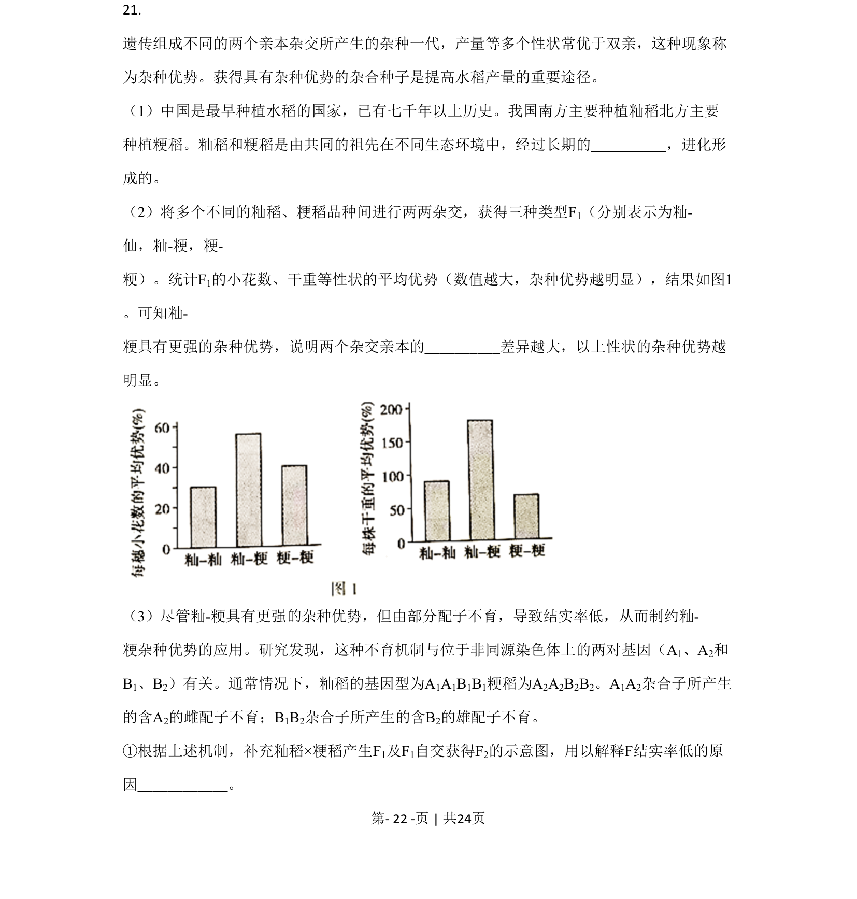
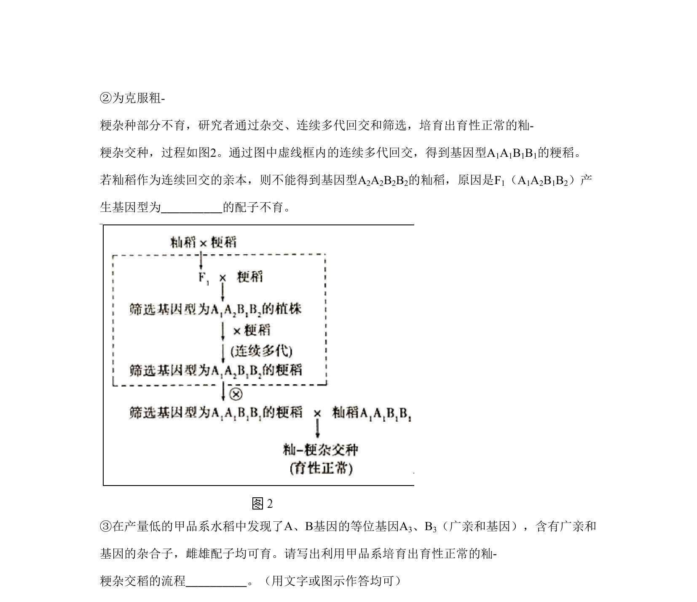
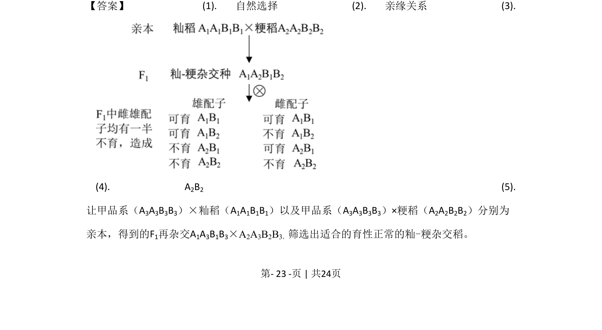
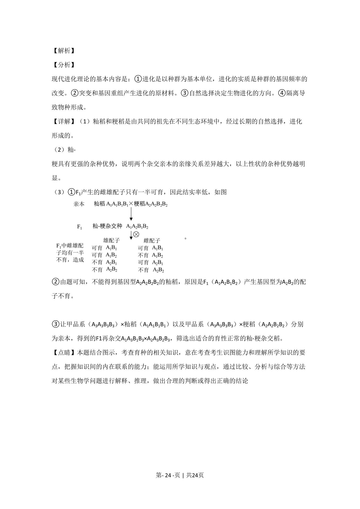

## 题面

## 摘要

本题结合籼稻和粳稻杂交，考查现代进化理论、杂种优势及配子不育原理在育种中的应用。

## 关联考点

- [[现代进化理论]]
- [[803-基因频率|基因频率]]
- [[892-杂种优势|杂种优势]]
- [[配子不育]]

## 答案与解析

> 📄 原 PDF 第 22 页：`素材/真题/北京/2008-2024·（北京）生物高考真题/2020年高考生物试卷（北京）（解析卷）.pdf`

<!-- 题干文本-start -->
## 题干文本
21. 
遗传组成不同的两个亲本杂交所产生的杂种一代，产量等多个性状常优于双亲，这种现象称
为杂种优势。获得具有杂种优势的杂合种子是提高水稻产量的重要途径。
（1）中国是最早种植水稻的国家，已有七千年以上历史。我国南方主要种植籼稻北方主要
种植粳稻。籼稻和粳稻是由共同的祖先在不同生态环境中，经过长期的__________，进化形
成的。
（2）将多个不同的籼稻、粳稻品种间进行两两杂交，获得三种类型F1（分别表示为籼-
仙，籼-粳，粳-
粳）。统计F1的小花数、干重等性状的平均优势（数值越大，杂种优势越明显），结果如图1
。可知籼-
粳具有更强的杂种优势，说明两个杂交亲本的__________差异越大，以上性状的杂种优势越
明显。
（3）尽管籼-粳具有更强 杂种优势，但由部分配子不育，导致结实率低，从而制约籼 -
粳杂种优势的应用。研究发现，这种不育机制与位于非同源染色体上的两对基因（A1、A2和
B1、B2）有关。通常情况下，籼稻的基因型为A1A1B1B1粳稻为A2A2B2B2。A1A2杂合子所产生
的含A2的雌配子不育；B1B2杂合子所产生的含B2的雄配子不育。
①根据上述机制，补充籼稻×粳稻产生F1及F1自交获得F2的示意图，用以解释F结实率低的原
因____________。
的
<!-- 题干文本-end -->

<!-- 解析文本-start -->
## 解析文本

<!-- 解析文本-end -->
