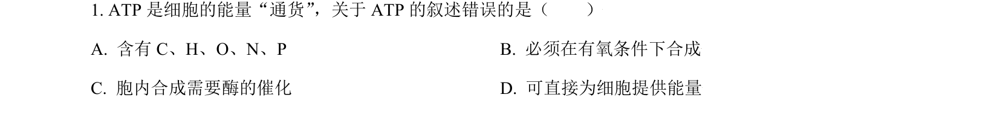
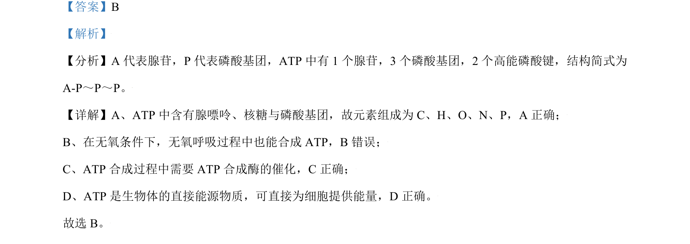

## 题面

## 摘要

考查ATP的组成与功能以及细胞核各部分结构的作用。

## 关联考点

- [[ATP的结构与功能]]
- [[细胞核结构]]
- [[896-核孔|核孔]]
- [[895-核仁|核仁]]

## 答案与解析

> 📄 原 PDF 第 1 页：`素材/真题/北京/2008-2024·（北京）生物高考真题/2021年高考生物试卷（北京）（解析卷）.pdf`

<!-- 题干文本-start -->
## 题干文本
1. ATP 是细胞的能量“通货”，关于ATP 的叙述错误的是（　　）
A. 含有 C、H、O、N、P B. 必须在有氧条件下合成
C. 胞内合成需要酶的催化 D. 可直接为细胞提供能量
<!-- 题干文本-end -->

<!-- 解析文本-start -->
## 解析文本
【答案】B
【解析】
【分析】A 代表腺苷，P 代表磷酸基团，ATP 中有 1 个腺苷，3 个磷酸基团，2 个高能磷酸键，结构简式为
A-P～P～P。
【详解】A、ATP 中含有腺嘌呤、核糖与磷酸基团，故元素组成为 C、H、O、N、P，A 正确；
B、在无氧条件下，无氧呼吸过程中也能合成 ATP，B错误；
C、ATP 合成过程中需要 ATP 合成酶的催化，C正确；
D、ATP 是生物体的直接能源物质，可直接为细胞提供能量，D 正确。
故选 B。
<!-- 解析文本-end -->
