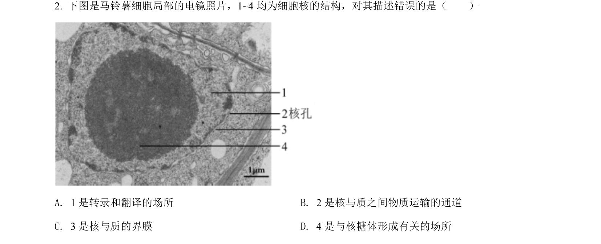
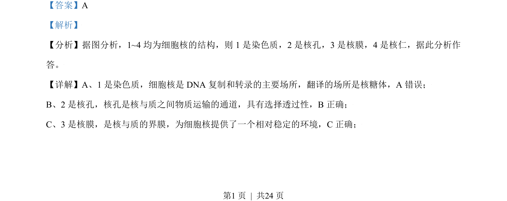
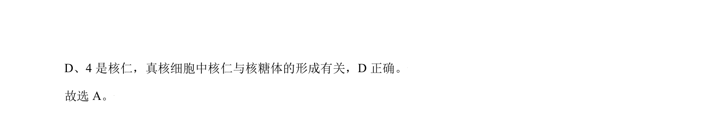

## 题面

## 摘要

考查细胞核各部分结构及其功能，包括染色质、核孔、核膜和核仁的作用。

## 关联考点

- [[049-细胞核|细胞核]]
- [[染色质]]
- [[896-核孔|核孔]]
- [[895-核仁|核仁]]

## 答案与解析

> 📄 原 PDF 第 1 页：`素材/真题/北京/2008-2024·（北京）生物高考真题/2021年高考生物试卷（北京）（解析卷）.pdf`
