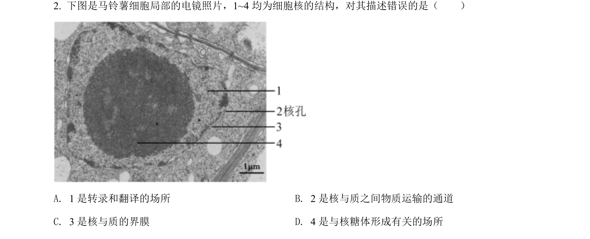
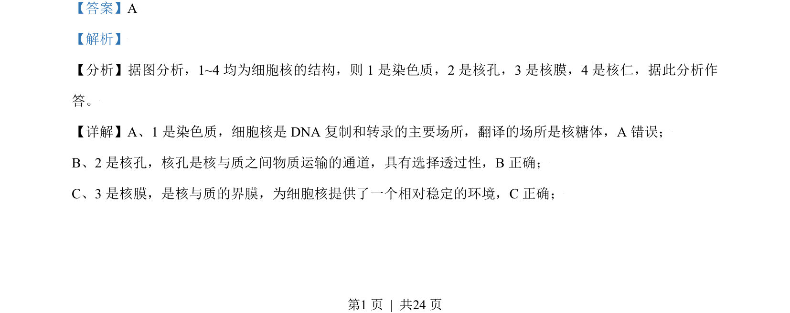
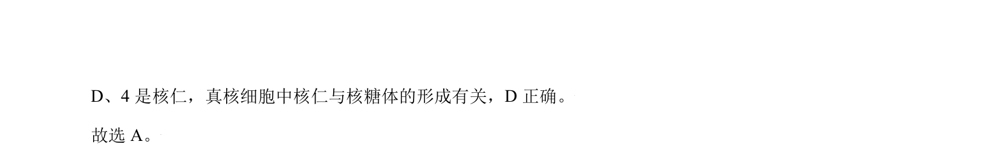

## 题面

## 摘要

考查细胞核各部分结构及其功能，包括染色质、核孔、核膜和核仁的作用。

## 关联考点

- [[049-细胞核|细胞核]]
- [[染色质]]
- [[896-核孔|核孔]]
- [[895-核仁|核仁]]

## 答案与解析

> 📄 原 PDF 第 1 页：`素材/真题/北京/2008-2024·（北京）生物高考真题/2021年高考生物试卷（北京）（解析卷）.pdf`

<!-- 题干文本-start -->
## 题干文本
2. 下图是马铃薯细胞局部的电镜照片，1~4 均为细胞核的结构，对其描述错误的是（　　）
A. 1 是转录和翻译的场所B. 2 是核与质之间物质运输的通道
C. 3 是核与质的界膜D. 4 是与核糖体形成有关的场所
<!-- 题干文本-end -->

<!-- 解析文本-start -->
## 解析文本
【答案】A
【解析】
【分析】据图分析，1~4 均为细胞核的结构，则 1 是染色质，2 是核孔，3 是核膜，4 是核仁，据此分析作
答。
【详解】A、1 是染色质，细胞核是 DNA 复制和转录的主要场所，翻译的场所是核糖体，A 错误；
B、2 是核孔，核孔是核与质之间物质运输的通道，具有选择透过性，B正确；
C、3 是核膜，是核与质的界膜，为细胞核提供了一个相对稳定的环境，C正确；
<!-- 解析文本-end -->
