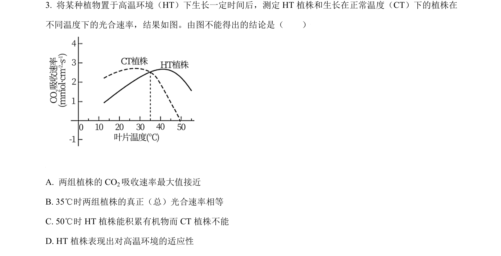
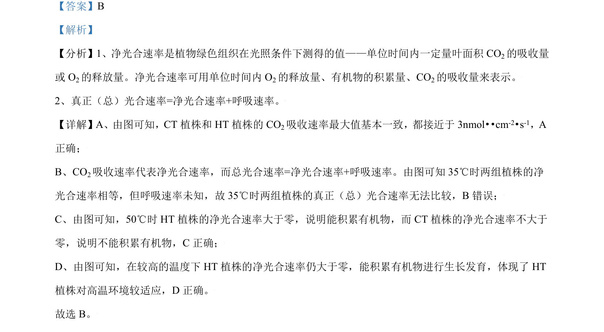

## 题面

## 摘要

该题考查光合速率相关概念辨析，通过曲线图分析净光合速率与总光合速率、温度适应性等。

## 关联考点

- [[552-净光合速率|净光合速率]]
- [[总光合速率]]
- [[呼吸速率]]
- [[温度适应性]]

## 答案与解析

> 📄 原 PDF 第 2 页：`素材/真题/北京/2008-2024·（北京）生物高考真题/2021年高考生物试卷（北京）（解析卷）.pdf`
