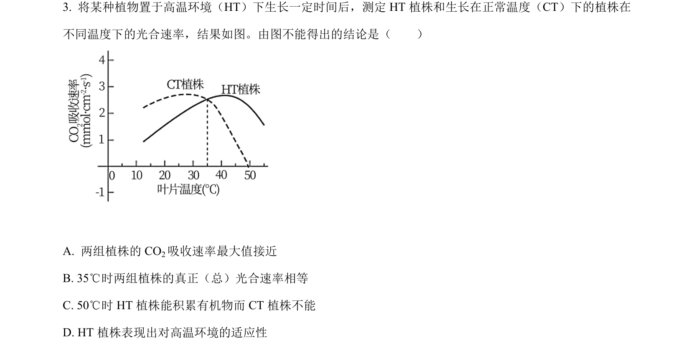
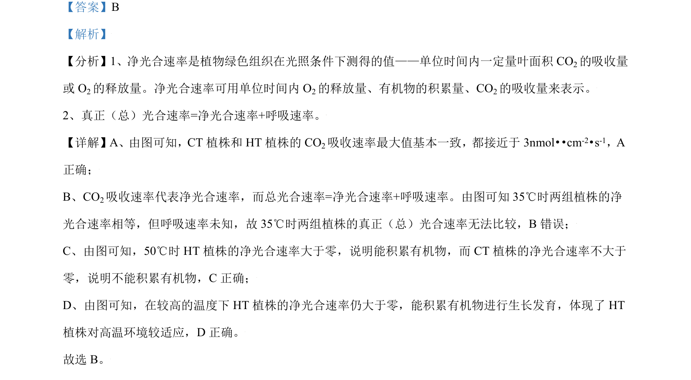

## 题面

## 摘要

该题考查光合速率相关概念辨析，通过曲线图分析净光合速率与总光合速率、温度适应性等。

## 关联考点

- [[552-净光合速率|净光合速率]]
- [[906-总光合速率|总光合速率]]
- [[呼吸速率]]
- [[温度适应性]]

## 答案与解析

> 📄 原 PDF 第 2 页：`素材/真题/北京/2008-2024·（北京）生物高考真题/2021年高考生物试卷（北京）（解析卷）.pdf`

<!-- 题干文本-start -->
## 题干文本
3. 将某种植物置于高温环境（HT）下生长一定时间后，测定 HT 植株和生长在正常温度（CT）下的植株在
不同温度下的光合速率，结果如图。由图不能得出的结论是（　　）
A. 两组植株的 CO2吸收速率最大值接近
B. 35℃时两组植株的真正（总）光合速率相等
C. 50℃时 HT 植株能积累有机物而 CT植株不能
D. HT 植株表现出对高温环境的适应性
<!-- 题干文本-end -->

<!-- 解析文本-start -->
## 解析文本
【答案】B
【解析】
【分析】1、净光合速率是植物绿色组织在光照条件下测得的值——单位时间内一定量叶面积 CO2的吸收量
或 O2的释放量。净光合速率可用单位时间内 O2的释放量、有机物的积累量、CO2的吸收量来表示。
2、真正（总）光合速率=净光合速率+呼吸速率。
【详解】A、由图可知，CT植株和 HT 植株的 CO2吸收速率最大值基本一致，都接近于3nmol••cm-2•s-1，A
正确；
B、CO2吸收速率代表净光合速率，而总光合速率=净光合速率+呼吸速率。由图可知 35℃时两组植株的净
光合速率相等，但呼吸速率未知，故 35℃时两组植株的真正（总）光合速率无法比较，B错误；
C、由图可知，50℃时 HT 植株的净光合速率大于零，说明能积累有机物，而 CT植株的净光合速率不大于
零，说明不能积累有机物，C正确；
D、由图可知，在较高的温度下 HT 植株的净光合速率仍大于零，能积累有机物进行生长发育，体现了 HT
植株对高温环境较适应，D 正确。
故选 B。
<!-- 解析文本-end -->
