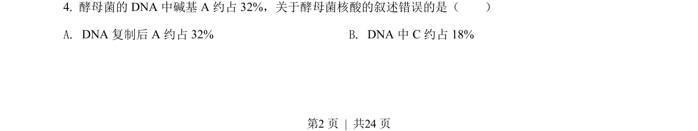
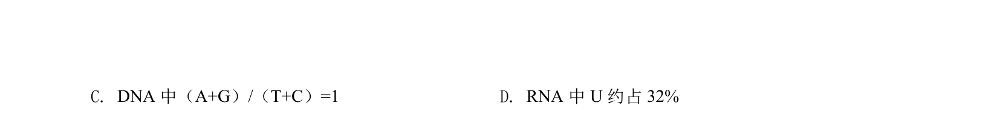
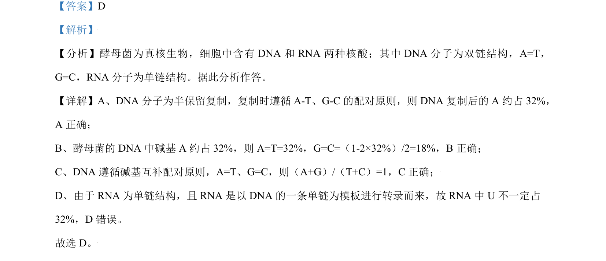

## 题面

## 摘要

酵母菌DNA与RNA结构及碱基组成分析，涉及碱基互补配对、复制与转录计算。

## 关联考点

- [[真核生物核酸组成]]
- [[DNA双链碱基互补配对]]
- [[288-半保留复制|半保留复制]]
- [[转录与RNA单链结构]]

## 答案与解析

> 📄 原 PDF 第 2 页：`素材/真题/北京/2008-2024·（北京）生物高考真题/2021年高考生物试卷（北京）（解析卷）.pdf`
