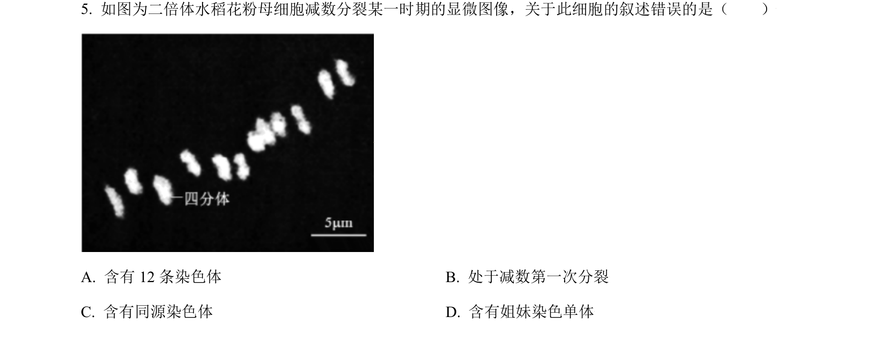
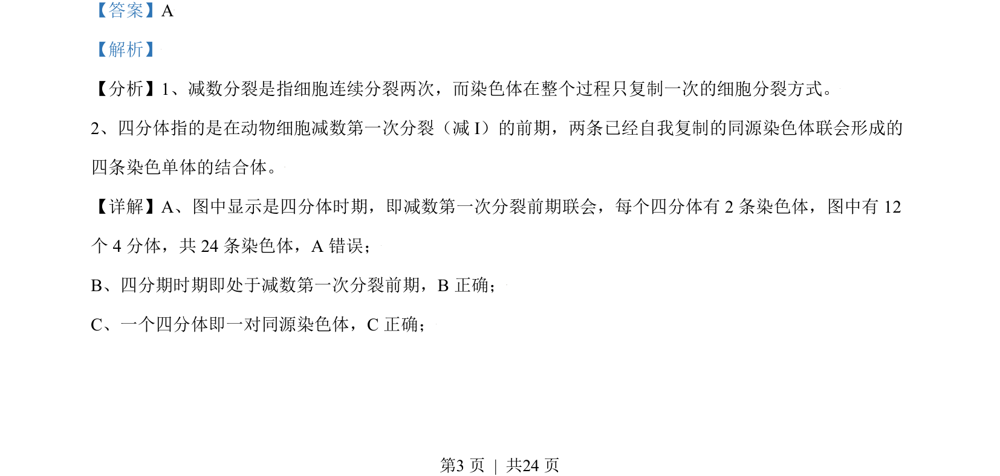
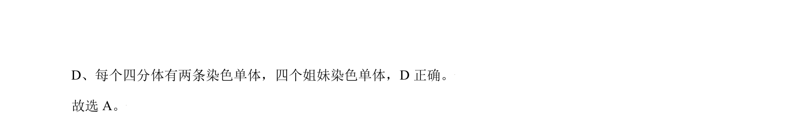

## 题面

## 摘要

该题考查减数分裂四分体时期染色体和姐妹染色单体的数量及行为特征。

## 关联考点

- [[277-减数分裂（高中必二）|减数分裂]]
- [[246-四分体|四分体]]
- [[245-同源染色体|同源染色体]]
- [[586-姐妹染色单体|姐妹染色单体]]

## 答案与解析

> 📄 原 PDF 第 3 页：`素材/真题/北京/2008-2024·（北京）生物高考真题/2021年高考生物试卷（北京）（解析卷）.pdf`
