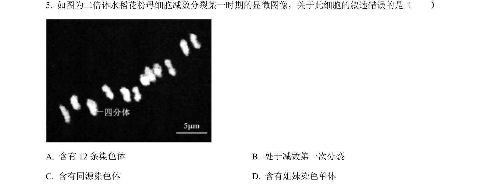
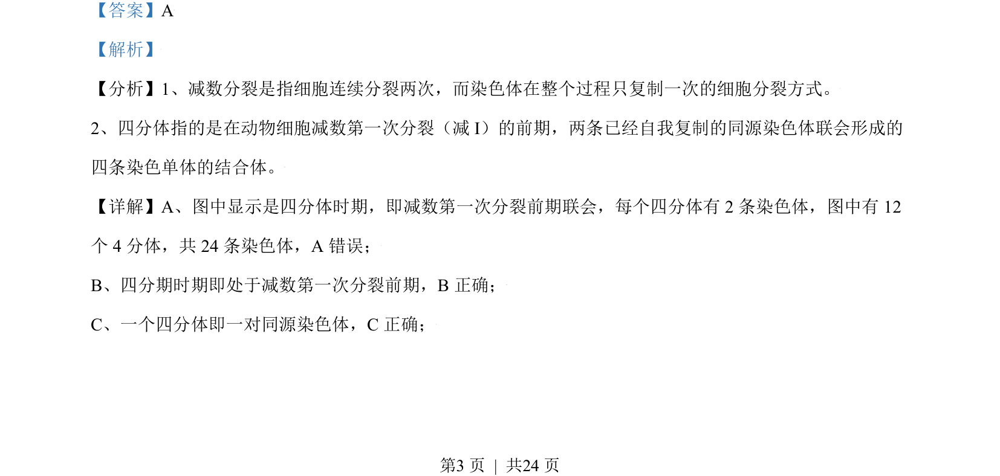
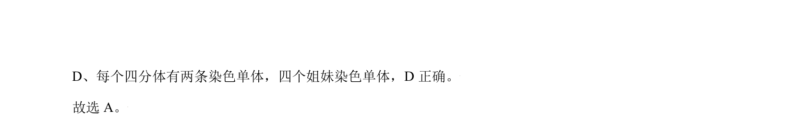

## 题面

## 摘要

该题考查减数分裂四分体时期染色体和姐妹染色单体的数量及行为特征。

## 关联考点

- [[277-减数分裂（高中必二）|减数分裂]]
- [[246-四分体|四分体]]
- [[245-同源染色体|同源染色体]]
- [[586-姐妹染色单体|姐妹染色单体]]

## 答案与解析

> 📄 原 PDF 第 3 页：`素材/真题/北京/2008-2024·（北京）生物高考真题/2021年高考生物试卷（北京）（解析卷）.pdf`

<!-- 题干文本-start -->
## 题干文本
5. 如图为二倍体水稻花粉母细胞减数分裂某一时期的显微图像，关于此细胞的叙述错误的是（　　）
A. 含有 12 条染色体 B. 处于减数第一次分裂
C. 含有同源染色体 D. 含有姐妹染色单体
<!-- 题干文本-end -->

<!-- 解析文本-start -->
## 解析文本
【答案】A
【解析】
【分析】1、减数分裂是指细胞连续分裂两次，而染色体在整个过程只复制一次的细胞分裂方式。
2、四分体指的是在动物细胞减数第一次分裂（减 I）的前期，两条已经自我复制的同源染色体联会形成的
四条染色单体的结合体。
【详解】A、图中显示是四分体时期，即减数第一次分裂前期联会，每个四分体有 2 条染色体，图中有 12
个 4 分体，共 24 条染色体，A 错误；
B、四分期时期即处于减数第一次分裂前期，B正确；
C、一个四分体即一对同源染色体，C正确；
<!-- 解析文本-end -->
