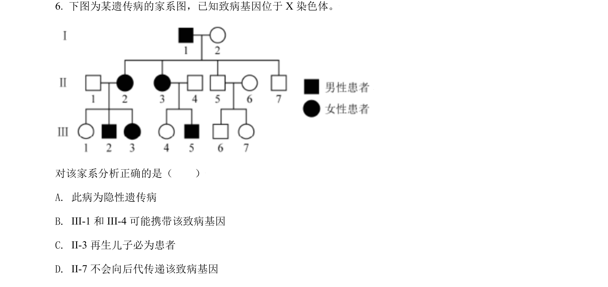
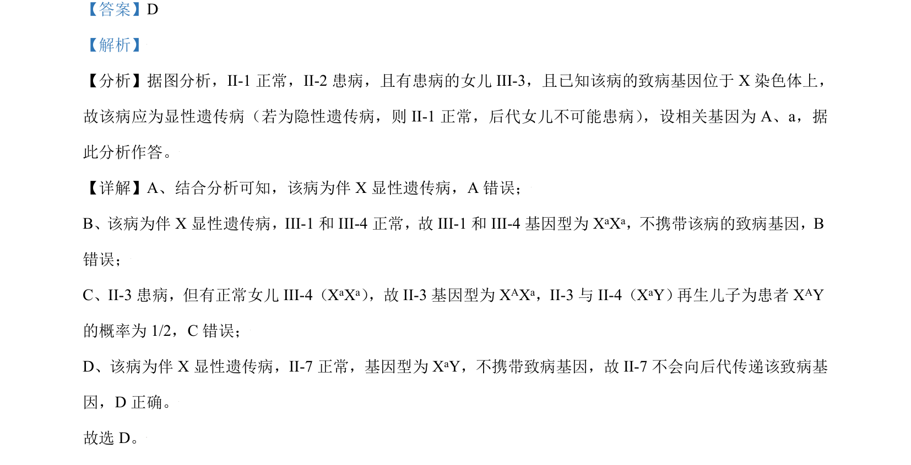

## 题面

## 摘要

考查伴X显性遗传病的系谱分析与基因型推断、概率计算

## 关联考点

- [[伴X显性遗传]]
- [[516-遗传系谱图分析|遗传系谱图分析]]
- [[576-基因型推断|基因型推断]]
- [[948-概率计算|概率计算]]

## 答案与解析

> 📄 原 PDF 第 4 页：`素材/真题/北京/2008-2024·（北京）生物高考真题/2021年高考生物试卷（北京）（解析卷）.pdf`
