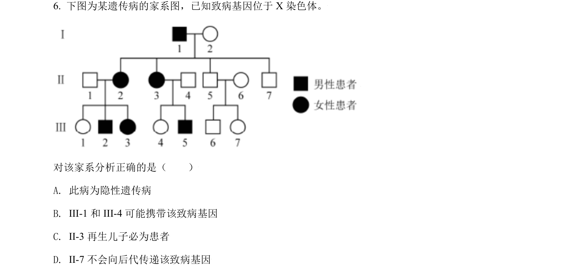
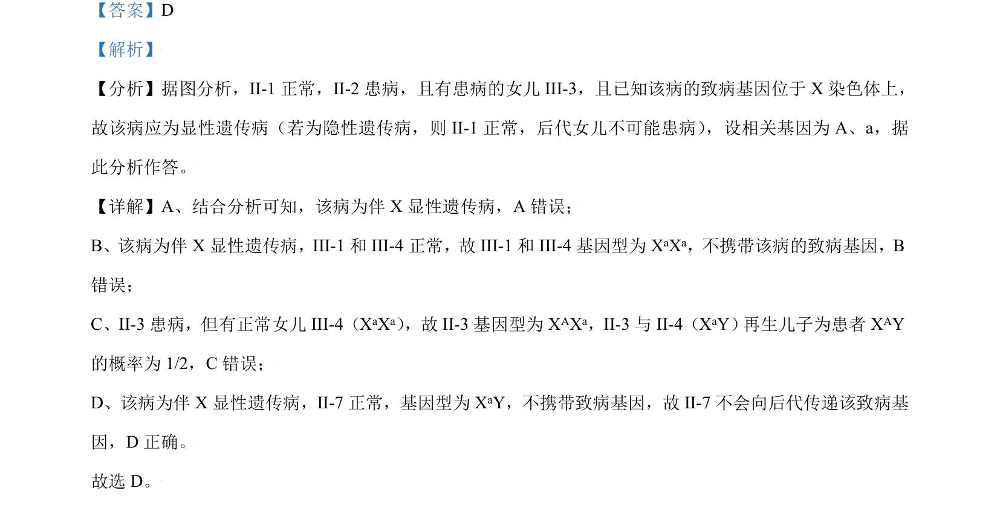

## 题面

## 摘要

考查伴X显性遗传病的系谱分析与基因型推断、概率计算

## 关联考点

- [[伴X显性遗传]]
- [[516-遗传系谱图分析|遗传系谱图分析]]
- [[576-基因型推断|基因型推断]]
- [[948-概率计算|概率计算]]

## 答案与解析

> 📄 原 PDF 第 4 页：`素材/真题/北京/2008-2024·（北京）生物高考真题/2021年高考生物试卷（北京）（解析卷）.pdf`

<!-- 题干文本-start -->
## 题干文本
6. 下图为某遗传病的家系图，已知致病基因位于 X 染色体。
对该家系分析正确的是（　　）
A. 此病为隐性遗传病
B. III-1 和 III-4 可能携带该致病基因
C. II-3 再生儿子必为患者
D. II-7 不会向后代传递该致病基因
<!-- 题干文本-end -->

<!-- 解析文本-start -->
## 解析文本
【答案】D
【解析】
【分析】据图分析，II-1 正常，II-2 患病，且有患病的女儿 III-3，且已知该病的致病基因位于 X 染色体上，
故该病应为显性遗传病（若为隐性遗传病，则 II-1 正常，后代女儿不可能患病） ，设相关基因为A、a，据
此分析作答。
【详解】A、结合分析可知，该病为伴 X 显性遗传病，A 错误；
B、该病为伴X 显性遗传病，III-1 和 III-4正常，故III-1 和 III-4 基因型为 XaXa，不携带该病的致病基因，B
错误；
C、II-3 患病，但有正常女儿 III-4（XaXa） ，故II-3 基因型为 XAXa，II-3 与 II-4（XaY） 再生儿子为患者XAY
的概率为 1/2，C错误；
D、该病为伴 X 显性遗传病，II-7 正常，基因型为 XaY，不携带致病基因，故 II-7 不会向后代传递该致病基
因，D 正确。
故选 D。
<!-- 解析文本-end -->
