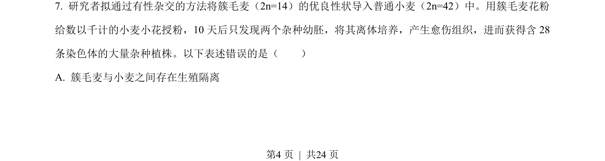
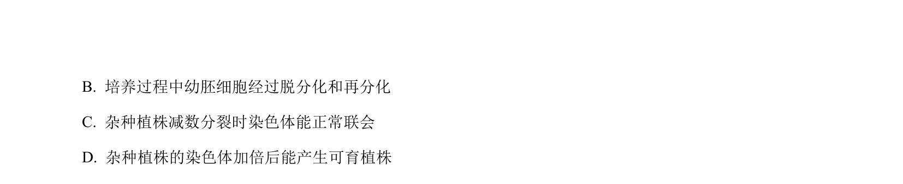
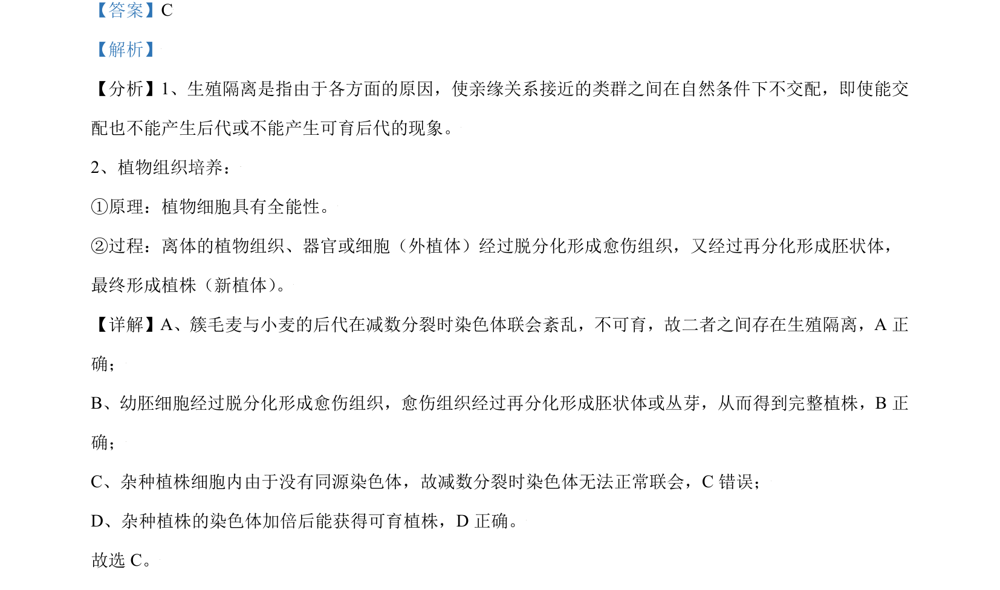

## 题面

## 摘要

考查生殖隔离、植物组织培养及染色体加倍育种的判断。

## 关联考点

- [[897-生殖隔离|生殖隔离]]
- [[437-植物组织培养|植物组织培养]]
- [[染色体联会]]
- [[多倍体育种]]

## 答案与解析

> 📄 原 PDF 第 4 页：`素材/真题/北京/2008-2024·（北京）生物高考真题/2021年高考生物试卷（北京）（解析卷）.pdf`

<!-- 题干文本-start -->
## 题干文本
7. 研究者拟通过有性杂交的方法将簇毛麦（2n=14）的优良性状导入普通小麦（2n=42）中。用簇毛麦花粉
给数以千计的小麦小花授粉，10 天后只发现两个杂种幼胚，将其离体培养，产生愈伤组织，进而获得含 28
条染色体的大量杂种植株。以下表述错误的是（　　）
A. 簇毛麦与小麦之间存在生殖隔离
<!-- 题干文本-end -->

<!-- 解析文本-start -->
## 解析文本

<!-- 解析文本-end -->
