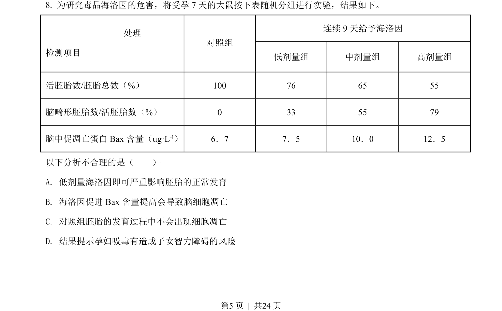
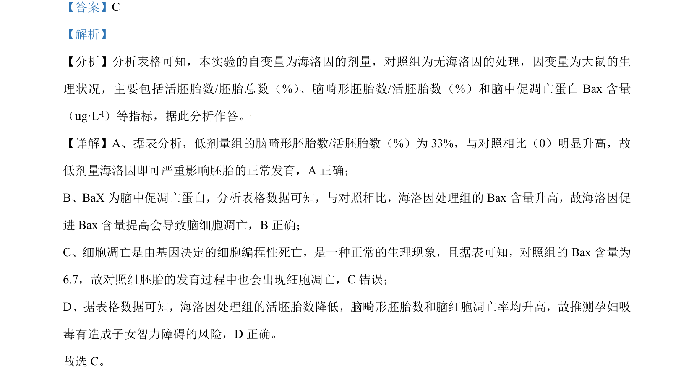

## 题面

## 摘要

本题通过海洛因剂量对大鼠胚胎发育影响的实验数据，考查实验变量分析及细胞凋亡相关结论判断。

## 关联考点

- [[203-自变量与因变量|自变量与因变量]]
- [[250-细胞凋亡|细胞凋亡]]
- [[Bax蛋白]]
- [[058-胚胎发育|胚胎发育]]

## 答案与解析

> 📄 原 PDF 第 5 页：`素材/真题/北京/2008-2024·（北京）生物高考真题/2021年高考生物试卷（北京）（解析卷）.pdf`
