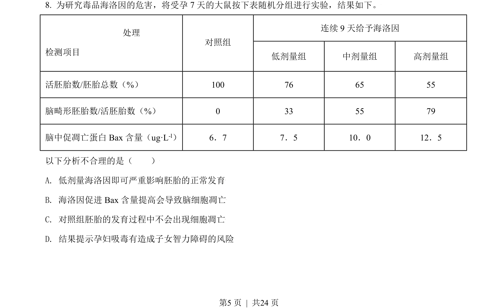
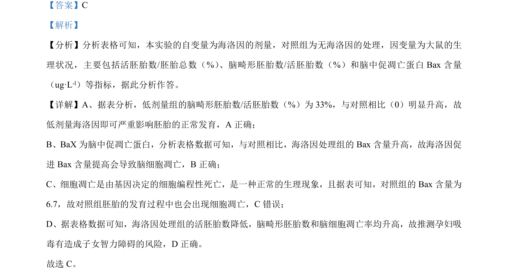

## 题面

## 摘要

本题通过海洛因剂量对大鼠胚胎发育影响的实验数据，考查实验变量分析及细胞凋亡相关结论判断。

## 关联考点

- [[203-自变量与因变量|自变量与因变量]]
- [[250-细胞凋亡|细胞凋亡]]
- [[Bax蛋白]]
- [[058-胚胎发育|胚胎发育]]

## 答案与解析

> 📄 原 PDF 第 5 页：`素材/真题/北京/2008-2024·（北京）生物高考真题/2021年高考生物试卷（北京）（解析卷）.pdf`

<!-- 题干文本-start -->
## 题干文本
8. 为研究毒品海洛因的危害，将受孕 7 天的大鼠按下表随机分组进行实验，结果如下。
连续 9 天给予海洛因                      处理
检测项目
对照组
低剂量组 中剂量组 高剂量组
活胚胎数/胚胎总数（%） 100 76 65 55
脑畸形胚胎数/活胚胎数（%） 0 33 55 79
脑中促凋亡蛋白 Bax含量（ug·L-l） 6．7 7．5 10．0 12．5
以下分析不合理的是（　　）
A. 低剂量海洛因即可严重影响胚胎的正常发育
B. 海洛因促进 Bax含量提高会导致脑细胞凋亡
C. 对照组胚胎的发育过程中不会出现细胞凋亡
D. 结果提示孕妇吸毒有造成子女智力障碍的风险
<!-- 题干文本-end -->

<!-- 解析文本-start -->
## 解析文本

<!-- 解析文本-end -->
