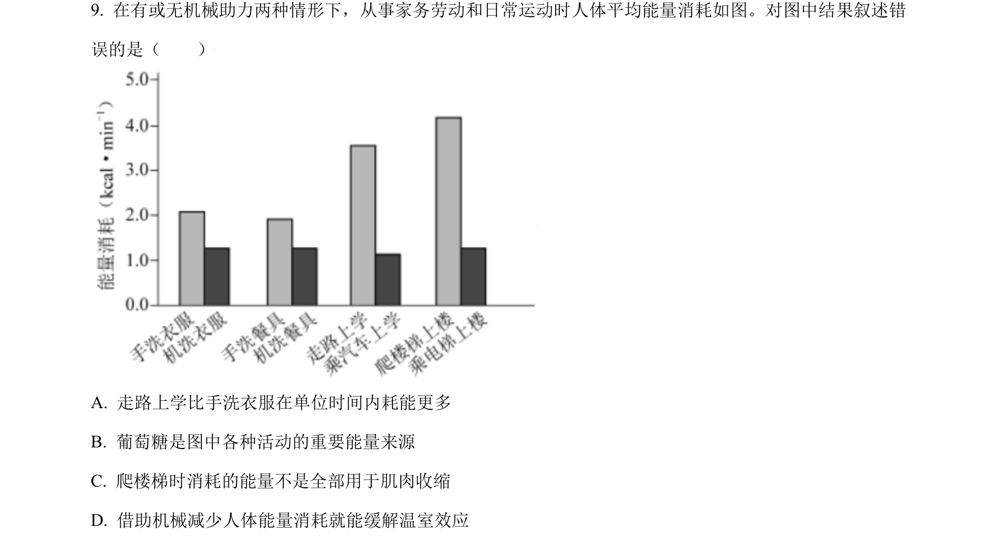
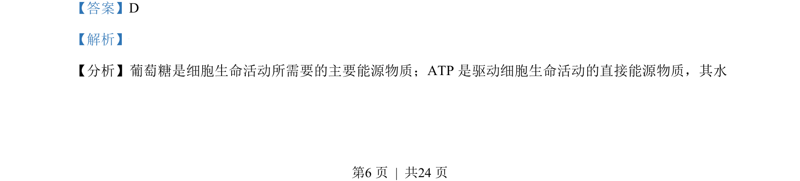
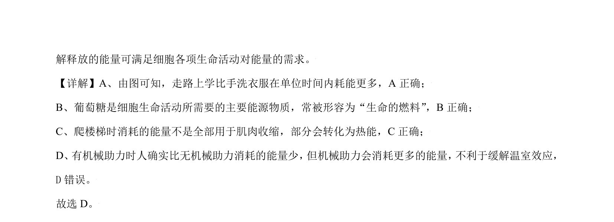

## 题面

## 摘要

该题考查细胞中主要能源物质葡萄糖及直接能源物质ATP的功能与能量代谢特点。

## 关联考点

- [[516-葡萄糖|葡萄糖]]
- [[234-ATP|ATP]]
- [[510-能量代谢|能量代谢]]

## 答案与解析

> 📄 原 PDF 第 6 页：`素材/真题/北京/2008-2024·（北京）生物高考真题/2021年高考生物试卷（北京）（解析卷）.pdf`
