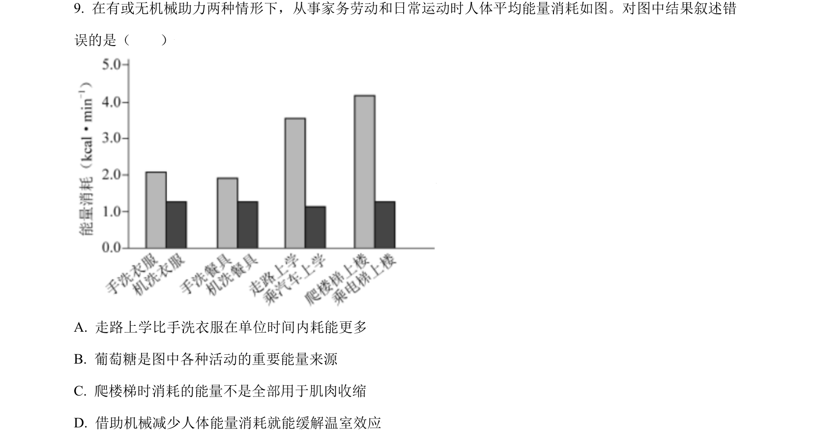
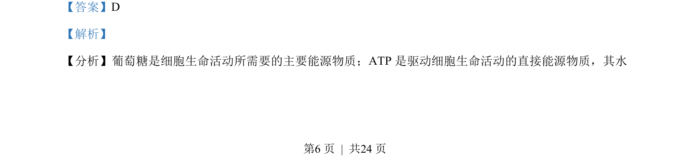
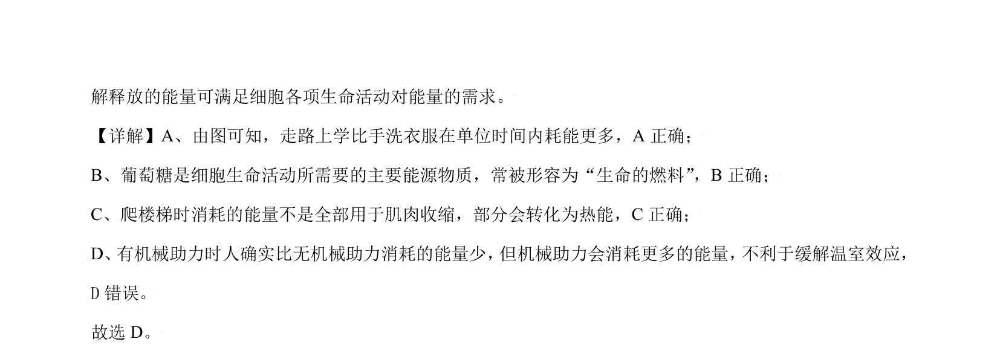

## 题面

## 摘要

该题考查细胞中主要能源物质葡萄糖及直接能源物质ATP的功能与能量代谢特点。

## 关联考点

- [[516-葡萄糖|葡萄糖]]
- [[234-ATP|ATP]]
- [[510-能量代谢|能量代谢]]

## 答案与解析

> 📄 原 PDF 第 6 页：`素材/真题/北京/2008-2024·（北京）生物高考真题/2021年高考生物试卷（北京）（解析卷）.pdf`

<!-- 题干文本-start -->
## 题干文本
9. 在有或无机械助力两种情形下，从事家务劳动和日常运动时人体平均能量消耗如图。对图中结果叙述错
误的是（　　）
A. 走路上学比手洗衣服在单位时间内耗能更多
B. 葡萄糖是图中各种活动的重要能量来源
C. 爬楼梯时消耗的能量不是全部用于肌肉收缩
D. 借助机械减少人体能量消耗就能缓解温室效应
<!-- 题干文本-end -->

<!-- 解析文本-start -->
## 解析文本
【答案】D
【解析】
【分析】葡萄糖是细胞生命活动所需要的主要能源物质； ATP 是驱动细胞生命活动的直接能源物质，其水
<!-- 解析文本-end -->
