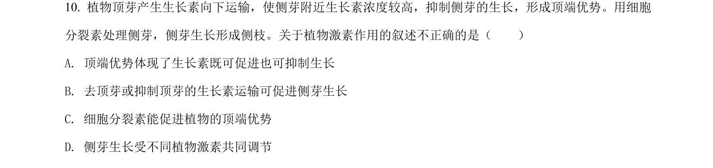
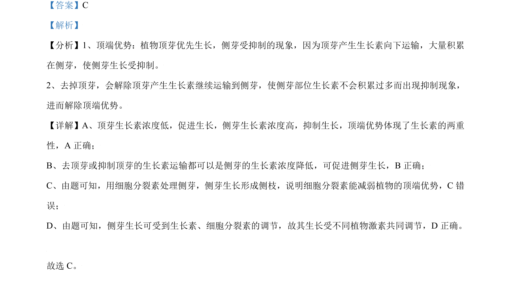

## 题面

## 摘要

考查顶端优势原理，生长素两重性及细胞分裂素对侧芽生长的影响。

## 关联考点

- [[352-顶端优势|顶端优势]]
- [[643-生长素两重性|生长素两重性]]
- [[349-细胞分裂素|细胞分裂素]]
- [[植物激素调节]]

## 答案与解析

> 📄 原 PDF 第 7 页：`素材/真题/北京/2008-2024·（北京）生物高考真题/2021年高考生物试卷（北京）（解析卷）.pdf`
