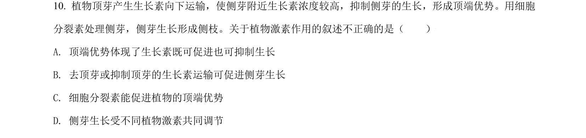
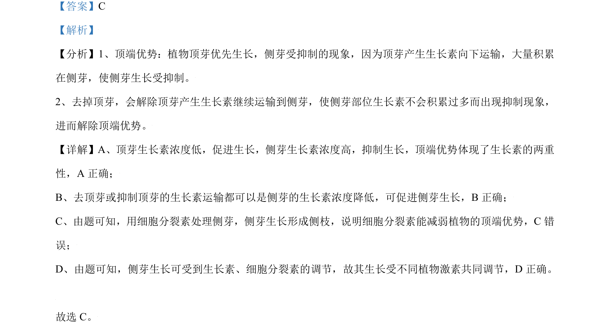

## 题面

## 摘要

考查顶端优势原理，生长素两重性及细胞分裂素对侧芽生长的影响。

## 关联考点

- [[352-顶端优势|顶端优势]]
- [[643-生长素两重性|生长素两重性]]
- [[349-细胞分裂素|细胞分裂素]]
- [[植物激素调节]]

## 答案与解析

> 📄 原 PDF 第 7 页：`素材/真题/北京/2008-2024·（北京）生物高考真题/2021年高考生物试卷（北京）（解析卷）.pdf`

<!-- 题干文本-start -->
## 题干文本
10. 植物顶芽产生生长素向下运输，使侧芽附近生长素浓度较高，抑制侧芽的生长，形成顶端优势。用细胞
分裂素处理侧芽，侧芽生长形成侧枝。关于植物激素作用的叙述不正确的是（　　）
A. 顶端优势体现了生长素既可促进也可抑制生长
B. 去顶芽或抑制顶芽的生长素运输可促进侧芽生长
C. 细胞分裂素能促进植物的顶端优势
D. 侧芽生长受不同植物激素共同调节
<!-- 题干文本-end -->

<!-- 解析文本-start -->
## 解析文本
【答案】C
【解析】
【分析】1、顶端优势：植物顶芽优先生长，侧芽受抑制的现象，因为顶芽产生生长素向下运输，大量积累
在侧芽，使侧芽生长受抑制。
2、去掉顶芽，会解除顶芽产生生长素继续运输到侧芽，使侧芽部位生长素不会积累过多而出现抑制现象，
进而解除顶端优势。
【详解】A、顶芽生长素浓度低，促进生长，侧芽生长素浓度高，抑制生长，顶端优势体现了生长素的两重
性，A 正确；
B、去顶芽或抑制顶芽的生长素运输都可以是侧芽的生长素浓度降低，可促进侧芽生长，B正确；
C、由题可知，用细胞分裂素处理侧芽，侧芽生长形成侧枝，说明细胞分裂素能减弱植物的顶端优势，C错
误；
D、由题可知，侧芽生长可受到生长素、细胞分裂素的调节，故其生长受不同植物激素共同调节，D 正确。
故选 C。
<!-- 解析文本-end -->
