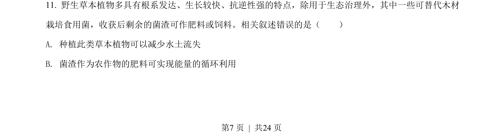
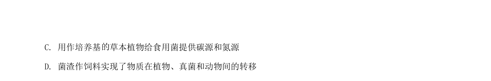
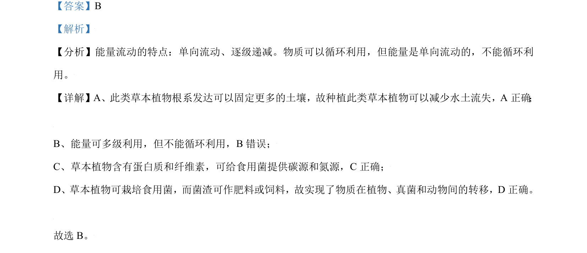

## 题面

## 摘要

本题考查能量流动的特点及生态系统的功能。

## 关联考点

- [[385-生态系统能量流动|能量流动]]
- [[383-生态系统物质循环|物质循环]]
- [[单向流动]]
- [[逐级递减]]

## 答案与解析

> 📄 原 PDF 第 7 页：`素材/真题/北京/2008-2024·（北京）生物高考真题/2021年高考生物试卷（北京）（解析卷）.pdf`
