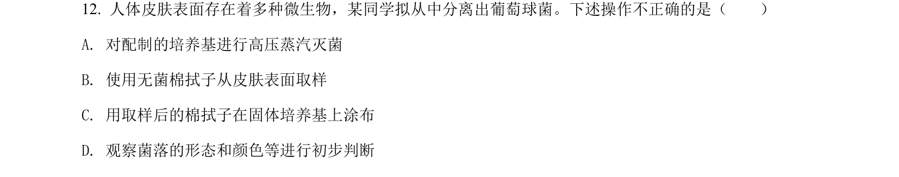
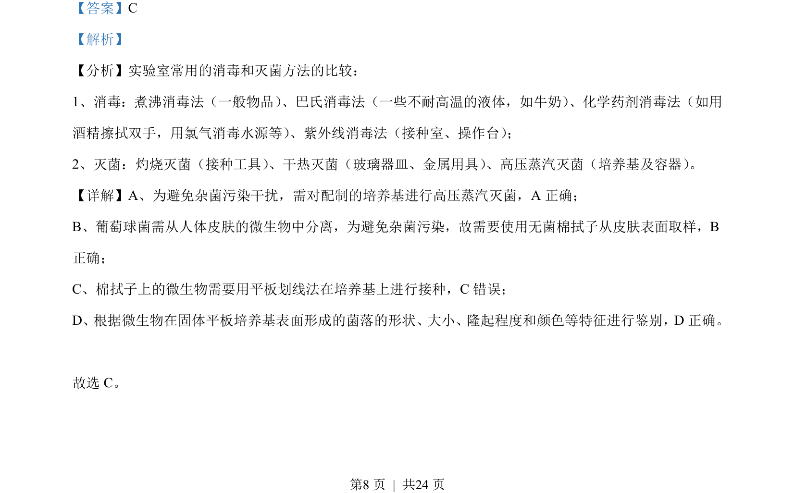

## 题面

## 摘要

考查实验室消毒与灭菌方法及微生物培养操作的正确判断

## 关联考点

- [[消毒]]
- [[430-灭菌|灭菌]]
- [[高压蒸汽灭菌]]
- [[594-平板划线法|平板划线法]]

## 答案与解析

> 📄 原 PDF 第 8 页：`素材/真题/北京/2008-2024·（北京）生物高考真题/2021年高考生物试卷（北京）（解析卷）.pdf`

<!-- 题干文本-start -->
## 题干文本
12. 人体皮肤表面存在着多种微生物，某同学拟从中分离出葡萄球菌。下述操作不正确的是（　　）
A. 对配制的培养基进行高压蒸汽灭菌
B. 使用无菌棉拭子从皮肤表面取样
C. 用取样后的棉拭子在固体培养基上涂布
D. 观察菌落的形态和颜色等进行初步判断
<!-- 题干文本-end -->

<!-- 解析文本-start -->
## 解析文本
【答案】C
【解析】
【分析】实验室常用的消毒和灭菌方法的比较：
1、消毒：煮沸消毒法（一般物品） 、巴氏消毒法（一些不耐高温的液体，如牛奶） 、化学药剂消毒法（如用
酒精擦拭双手，用氯气消毒水源等） 、紫外线消毒法（接种室、操作台） ；
2、灭菌：灼烧灭菌（接种工具） 、干热灭菌（玻璃器皿、金属用具） 、高压蒸汽灭菌（培养基及容器） 。
【详解】A、为避免杂菌污染干扰，需对配制的培养基进行高压蒸汽灭菌，A 正确；
B、葡萄球菌需从人体皮肤的微生物中分离，为避免杂菌污染，故需要使用无菌棉拭子从皮肤表面取样，B
正确；
C、棉拭子上的微生物需要用平板划线法在培养基上进行接种，C错误；
D、根据微生物在固体平板培养基表面形成的菌落的形状、大小、隆起程度和颜色等特征进行鉴别，D 正确。
故选 C。
的
<!-- 解析文本-end -->
