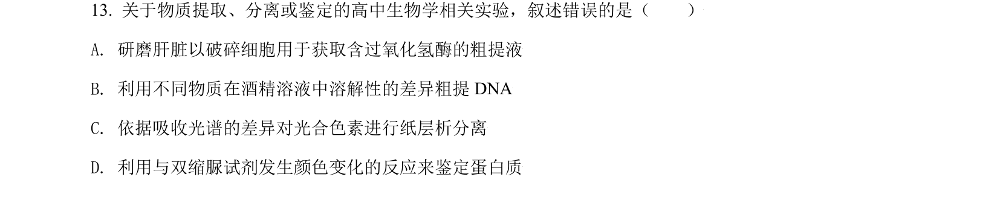
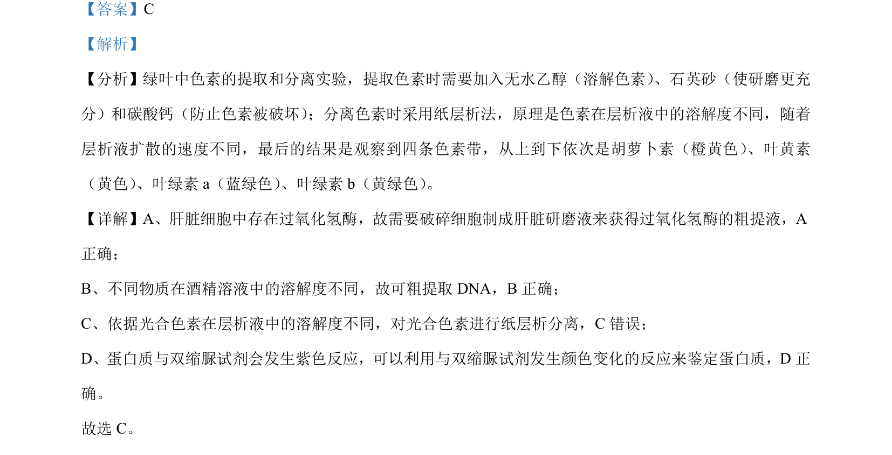

## 题面

## 摘要

本题通过正误辨析考查绿叶中色素提取分离、过氧化氢酶获取、DNA粗提取和蛋白质鉴定等实验原理

## 关联考点

- [[绿叶中色素提取和分离]]
- [[885-DNA粗提取|DNA粗提取]]
- [[蛋白质鉴定]]
- [[过氧化氢酶提取]]

## 答案与解析

> 📄 原 PDF 第 9 页：`素材/真题/北京/2008-2024·（北京）生物高考真题/2021年高考生物试卷（北京）（解析卷）.pdf`

<!-- 题干文本-start -->
## 题干文本
13. 关于物质提取、分离或鉴定的高中生物学相关实验，叙述错误的是（　　）
A. 研磨肝脏以破碎细胞用于获取含过氧化氢酶的粗提液
B. 利用不同物质在酒精溶液中溶解性的差异粗提 DNA
C. 依据吸收光谱的差异对光合色素进行纸层析分离
D. 利用与双缩脲试剂发生颜色变化的反应来鉴定蛋白质
<!-- 题干文本-end -->

<!-- 解析文本-start -->
## 解析文本
【答案】C
【解析】
【分析】绿叶中色素的提取和分离实验，提取色素时需要加入无水乙醇（溶解色素） 、石英砂（使研磨更充
分）和碳酸钙（防止色素被破坏） ；分离色素时采用纸层析法，原理是色素在层析液中的溶解度不同，随着
层析液扩散的速度不同，最后的结果是观察到四条色素带，从上到下依次是胡萝卜素（橙黄色） 、叶黄素
（黄色） 、叶绿素a（蓝绿色） 、叶绿素b（黄绿色） 。
【详解】A、肝脏细胞中存在过氧化氢酶，故需要破碎细胞制成肝脏研磨液来获得过氧化氢酶的粗提液，A
正确；
B、不同物质在酒精溶液中的溶解度不同，故可粗提取 DNA，B正确；
C、依据光合色素在层析液中的溶解度不同，对光合色素进行纸层析分离，C错误；
D、蛋白质与双缩脲试剂会发生紫色反应，可以利用与双缩脲试剂发生颜色变化的反应来鉴定蛋白质，D 正
确。
故选 C。
<!-- 解析文本-end -->
