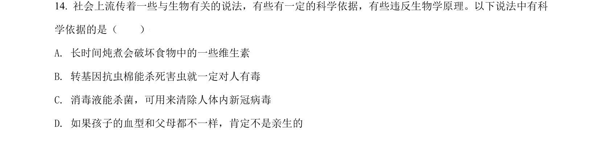
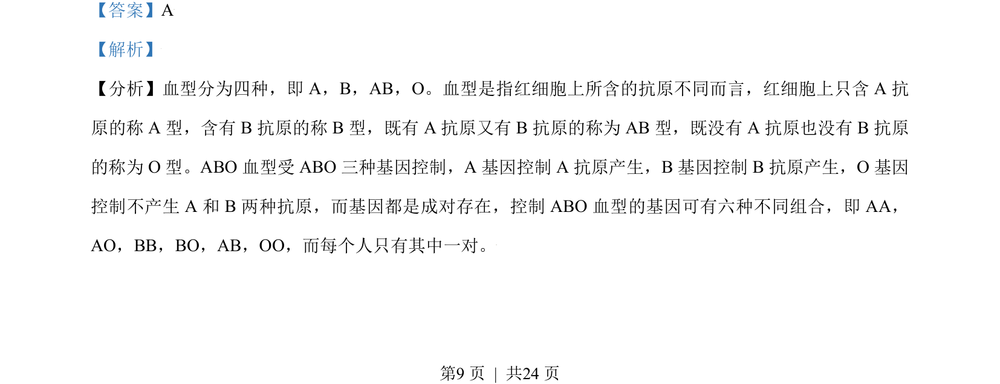
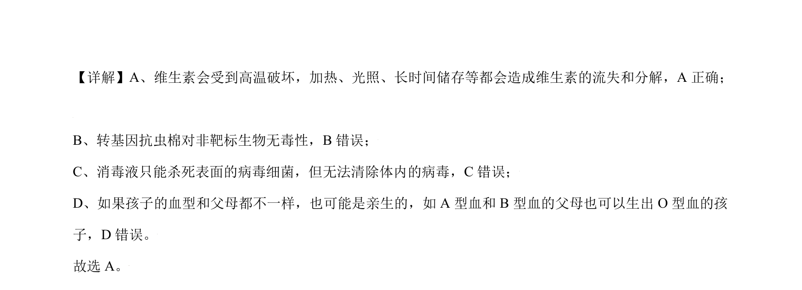

## 题面

## 摘要

该题考查生态保护措施的类型识别，要求区分生态保护与公共卫生等不同范畴

## 关联考点

- [[187-生态保护|生态保护]]
- [[552-sustainable|可持续发展]]
- [[环境保护措施]]

## 答案与解析

> 📄 原 PDF 第 9 页：`素材/真题/北京/2008-2024·（北京）生物高考真题/2021年高考生物试卷（北京）（解析卷）.pdf`

<!-- 题干文本-start -->
## 题干文本
14. 社会上流传着一些与生物有关的说法，有些有一定的科学依据，有些违反生物学原理。以下说法中有科
学依据的是（　　）
A. 长时间炖煮会破坏食物中的一些维生素
B. 转基因抗虫棉能杀死害虫就一定对人有毒
C. 消毒液能杀菌，可用来清除人体内新冠病毒
D. 如果孩子的血型和父母都不一样，肯定不是亲生的
<!-- 题干文本-end -->

<!-- 解析文本-start -->
## 解析文本
【答案】A
【解析】
【分析】血型分为四种，即 A，B，AB，O。血型是指红细胞上所含的抗原不同而言，红细胞上只含 A 抗
原的称 A 型，含有 B 抗原的称 B 型，既有 A 抗原又有 B 抗原的称为 AB 型，既没有 A 抗原也没有 B 抗原
的称为 O 型。ABO 血型受 ABO 三种基因控制，A 基因控制 A 抗原产生，B基因控制 B抗原产生，O 基因
控制不产生 A 和 B 两种抗原，而基因都是成对存在，控制 ABO 血型的基因可有六种不同组合，即 AA，
AO，BB，BO，AB，OO，而每个人只有其中一对。
<!-- 解析文本-end -->
