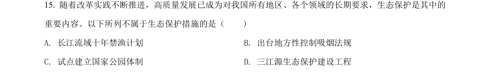
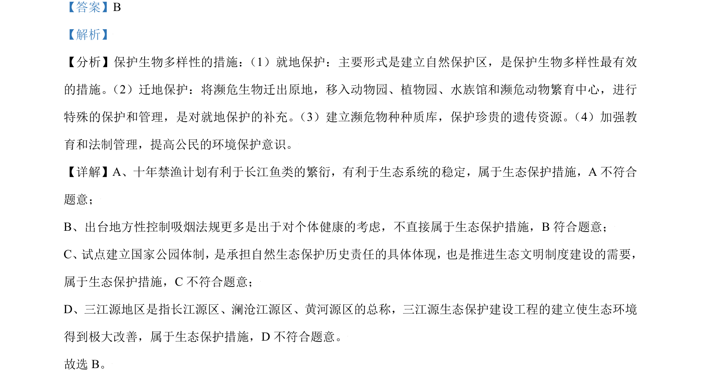

## 题面

## 摘要

该题考查生态保护措施判断及新冠病毒重组疫苗制备与免疫原理。

## 关联考点

- [[生态保护措施]]
- [[411-基因工程|基因工程]]
- [[637-特异性免疫|特异性免疫]]
- [[疫苗]]

## 答案与解析

> 📄 原 PDF 第 10 页：`素材/真题/北京/2008-2024·（北京）生物高考真题/2021年高考生物试卷（北京）（解析卷）.pdf`
