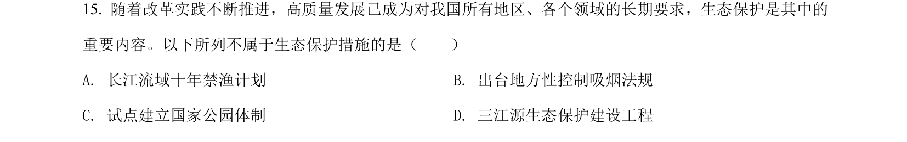
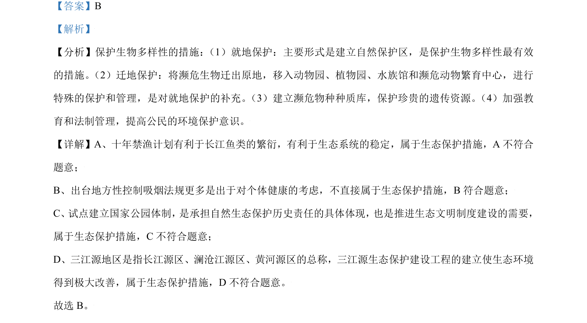

## 题面

## 摘要

该题考查生态保护措施判断及新冠病毒重组疫苗制备与免疫原理。

## 关联考点

- [[生态保护措施]]
- [[411-基因工程|基因工程]]
- [[637-特异性免疫|特异性免疫]]
- [[898-疫苗|疫苗]]

## 答案与解析

> 📄 原 PDF 第 10 页：`素材/真题/北京/2008-2024·（北京）生物高考真题/2021年高考生物试卷（北京）（解析卷）.pdf`

<!-- 题干文本-start -->
## 题干文本
15. 随着改革实践不断推进，高质量发展已成为对我国所有地区、各个领域的长期要求，生态保护是其中的
重要内容。以下所列不属于生态保护措施的是（　　）
A. 长江流域十年禁渔计划B. 出台地方性控制吸烟法规
C. 试点建立国家公园体制D. 三江源生态保护建设工程
<!-- 题干文本-end -->

<!-- 解析文本-start -->
## 解析文本
【答案】B
【解析】
【分析】保护生物多样性的措施： （1）就地保护：主要形式是建立自然保护区，是保护生物多样性最有效
的措施。 （2）迁地保护：将濒危生物迁出原地，移入动物园、植物园、水族馆和濒危动物繁育中心，进行
特殊的保护和管理，是对就地保护的补充。 （3）建立濒危物种种质库，保护珍贵的遗传资源。 （4）加强教
育和法制管理，提高公民的环境保护意识。
【详解】A、十年禁渔计划有利于长江鱼类的繁衍，有利于生态系统的稳定，属于生态保护措施，A 不符合
题意；
B、出台地方性控制吸烟法规更多是出于对个体健康的考虑，不直接属于生态保护措施，B符合题意；
C、 试点建立国家公园体制， 是承担自然生态保护历史责任的具体体现， 也是推进生态文明制度建设的需要，
属于生态保护措施，C不符合题意；
D、三江源地区是指长江源区、澜沧江源区、黄河源区的总称，三江源生态保护建设工程的建立使生态环境
得到极大改善，属于生态保护措施，D 不符合题意。
故选 B。
<!-- 解析文本-end -->
