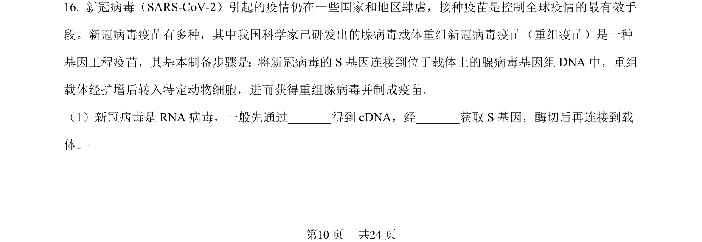
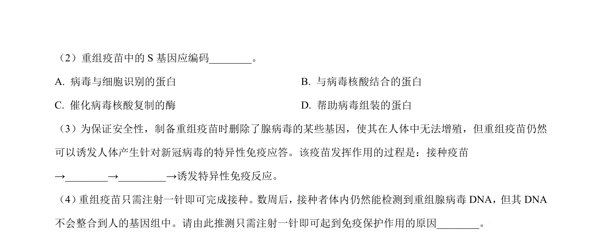
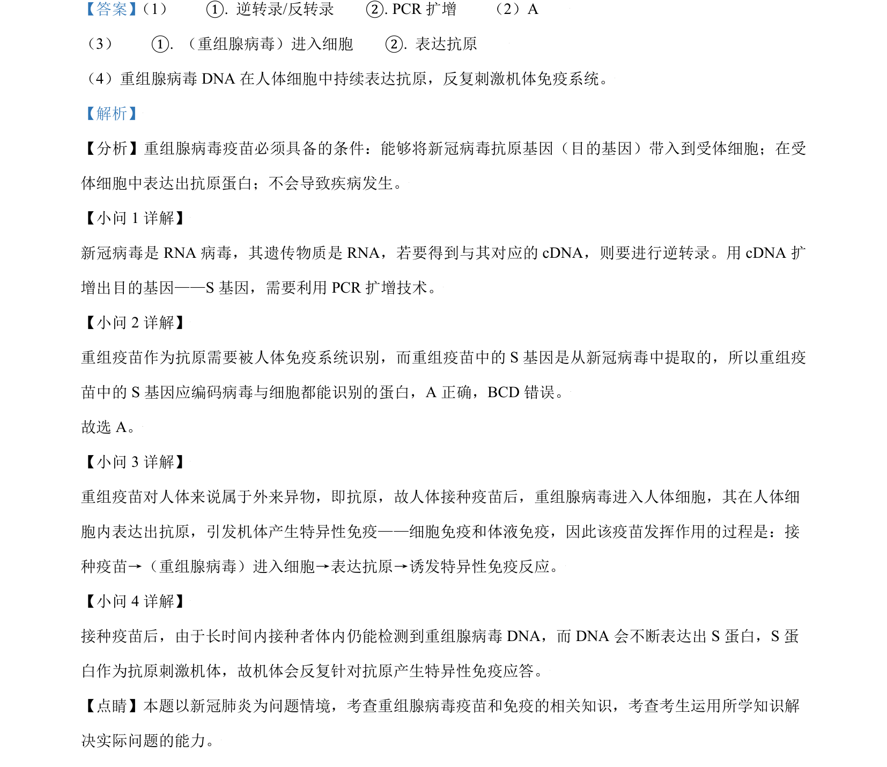

## 题面

## 摘要

通过实验探究柏桉藻入侵原因，考查生态系统成分、种间关系及实验分析。

## 关联考点

- [[382-生产者|生产者]]
- [[022-生物因素|种间关系]]
- [[生态入侵]]
- [[482-实验设计|实验设计]]

## 答案与解析

> 📄 原 PDF 第 10 页：`素材/真题/北京/2008-2024·（北京）生物高考真题/2021年高考生物试卷（北京）（解析卷）.pdf`
