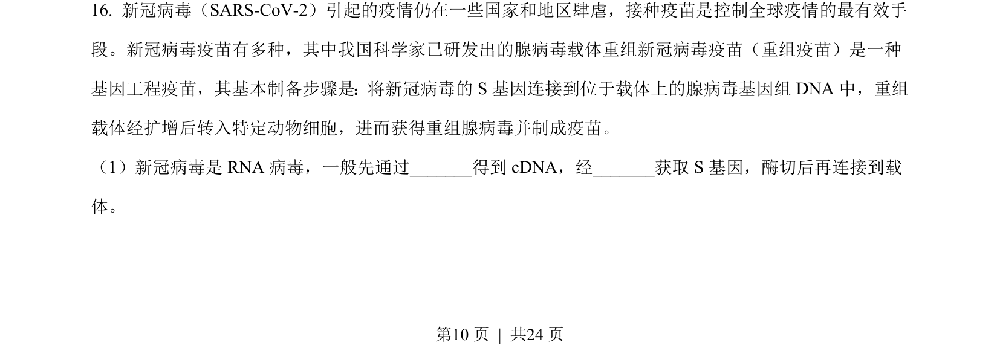
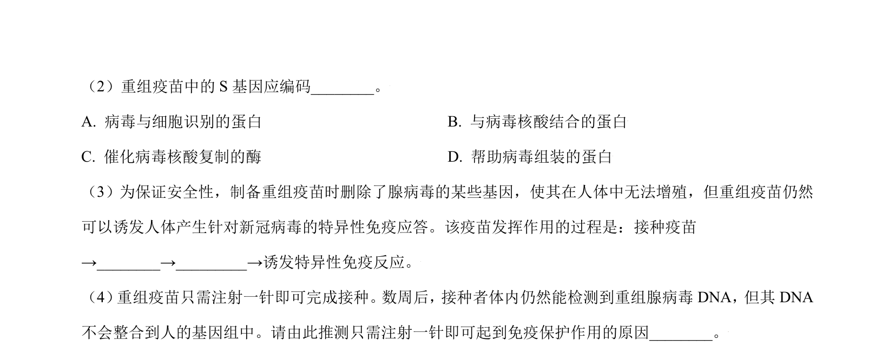
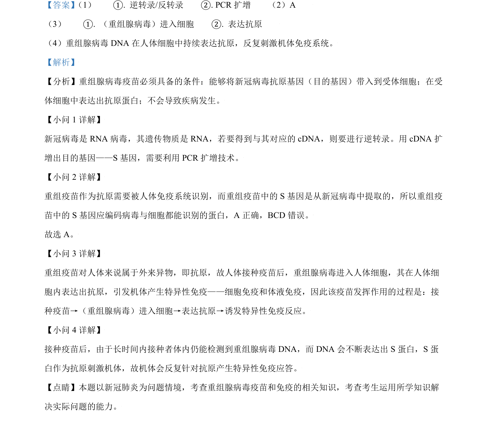

## 题面

## 摘要

通过实验探究柏桉藻入侵原因，考查生态系统成分、种间关系及实验分析。

## 关联考点

- [[382-生产者|生产者]]
- [[022-生物因素|种间关系]]
- [[生态入侵]]
- [[482-实验设计|实验设计]]

## 答案与解析

> 📄 原 PDF 第 10 页：`素材/真题/北京/2008-2024·（北京）生物高考真题/2021年高考生物试卷（北京）（解析卷）.pdf`

<!-- 题干文本-start -->
## 题干文本
16. 新冠病毒（SARS-CoV-2）引起的疫情仍在一些国家和地区肆虐，接种疫苗是控制全球疫情的最有效手
段。新冠病毒疫苗有多种，其中我国科学家已研发出的腺病毒载体重组新冠病毒疫苗（重组疫苗）是一种
基因工程疫苗，其基本制备步骤是：将新冠病毒的S 基因连接到位于载体上的腺病毒基因组 DNA 中，重组
载体经扩增后转入特定动物细胞，进而获得重组腺病毒并制成疫苗。
（1）新冠病毒是 RNA 病毒，一般先通过_______得到 cDNA，经_______获取 S 基因，酶切后再连接到载
体。
<!-- 题干文本-end -->

<!-- 解析文本-start -->
## 解析文本

<!-- 解析文本-end -->
