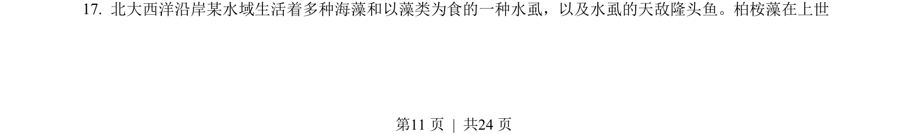
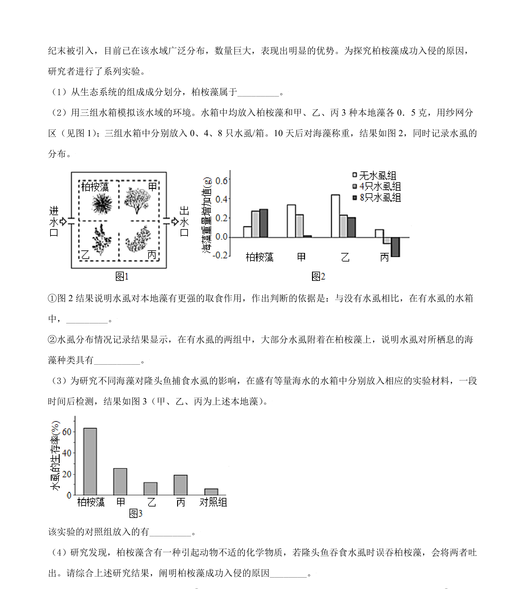
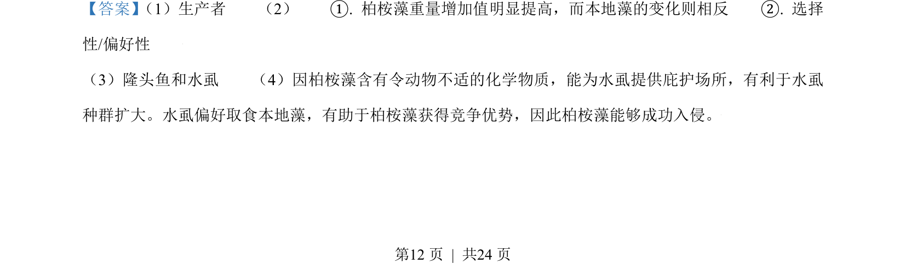
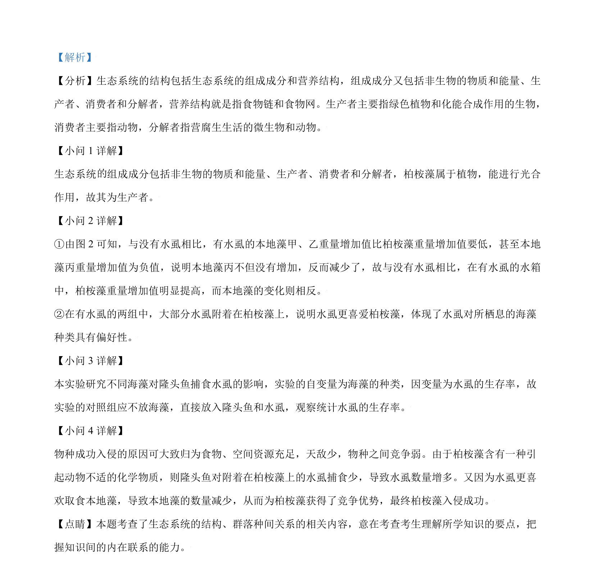

## 题面

## 摘要

本题组考查生态系统组成与种间关系，以及胰岛素调节血糖的机制与实验分析

## 关联考点

- [[502-生态系统的结构|生态系统的结构]]
- [[022-生物因素|种间关系]]
- [[512-血糖调节|血糖调节]]
- [[482-实验设计|实验设计]]

## 答案与解析

> 📄 原 PDF 第 11 页：`素材/真题/北京/2008-2024·（北京）生物高考真题/2021年高考生物试卷（北京）（解析卷）.pdf`
