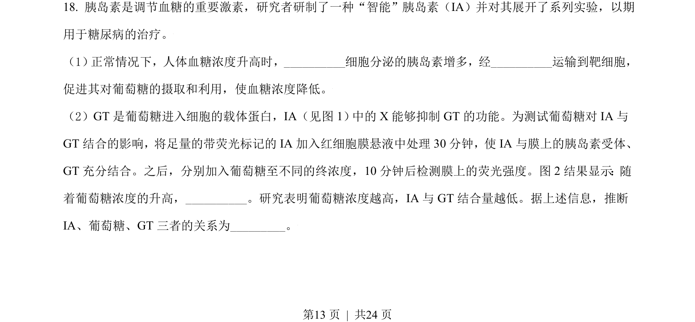
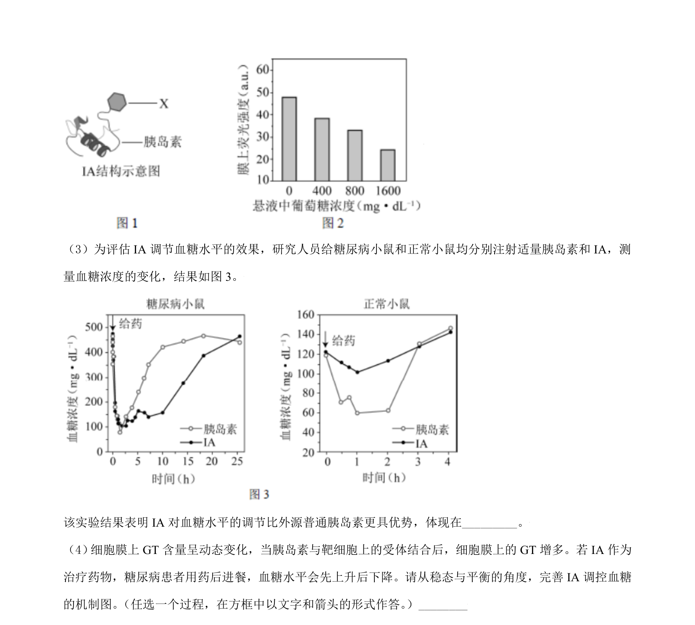
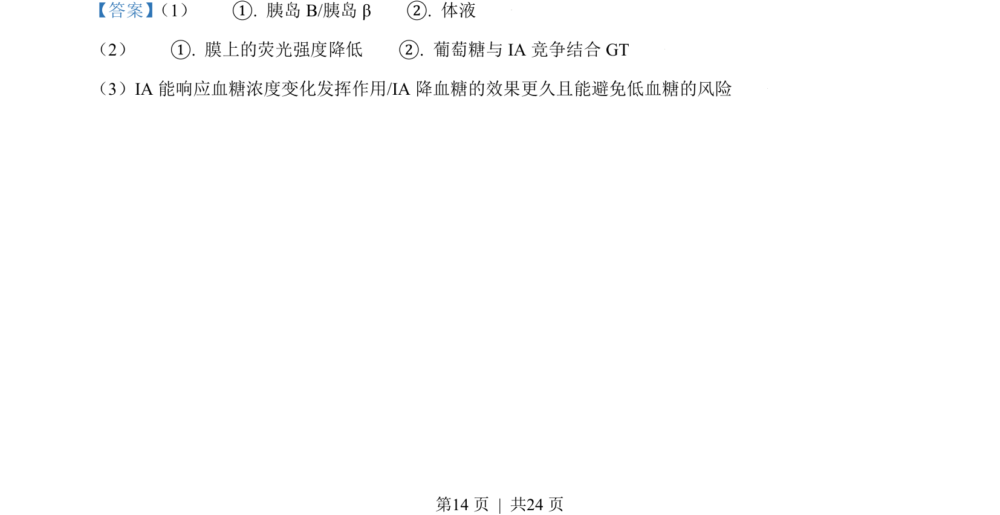
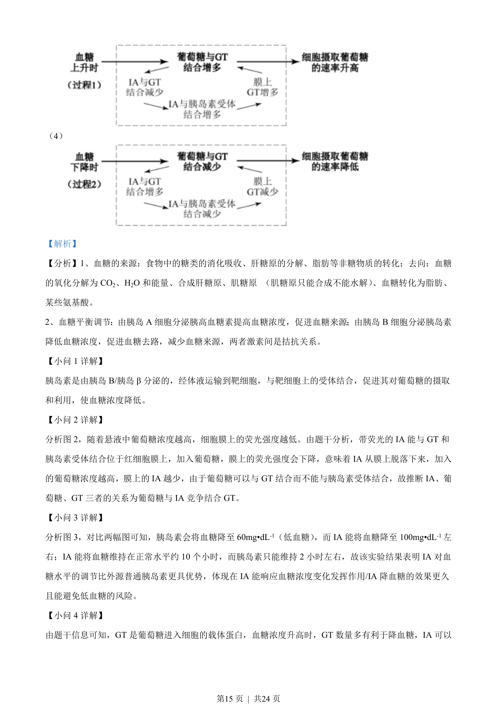
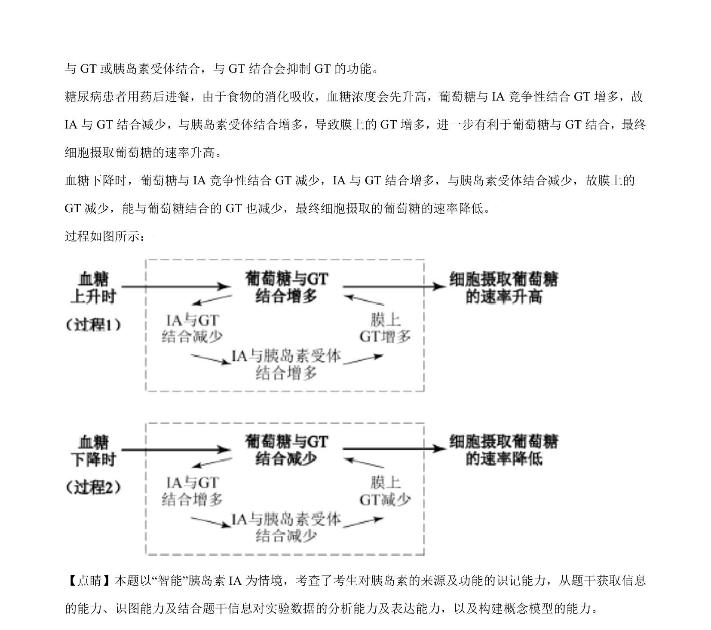

## 题面

## 摘要

（待补）

## 关联考点

## 答案与解析

> 📄 原 PDF 第 13 页：`素材/真题/北京/2008-2024·（北京）生物高考真题/2021年高考生物试卷（北京）（解析卷）.pdf`

<!-- 题干文本-start -->
## 题干文本
18. 胰岛素是调节血糖的重要激素，研究者研制了一种“智能”胰岛素（IA）并对其展开了系列实验，以期
用于糖尿病的治疗。
（1） 正常情况下，人体血糖浓度升高时，__________细胞分泌的胰岛素增多，经__________运输到靶细胞，
促进其对葡萄糖的摄取和利用，使血糖浓度降低。
（2）GT 是葡萄糖进入细胞的载体蛋白，IA（见图 1） 中的X 能够抑制 GT 的功能。为测试葡萄糖对 IA 与
GT 结合的影响，将足量的带荧光标记的IA 加入红细胞膜悬液中处理 30 分钟，使IA 与膜上的胰岛素受体、
GT 充分结合。之后，分别加入葡萄糖至不同的终浓度，10 分钟后检测膜上的荧光强度。图 2 结果显示：随
着葡萄糖浓度的升高，__________。研究表明葡萄糖浓度越高，IA 与 GT 结合量越低。据上述信息，推断
IA、葡萄糖、GT 三者的关系为_________。
的
<!-- 题干文本-end -->

<!-- 解析文本-start -->
## 解析文本

<!-- 解析文本-end -->
