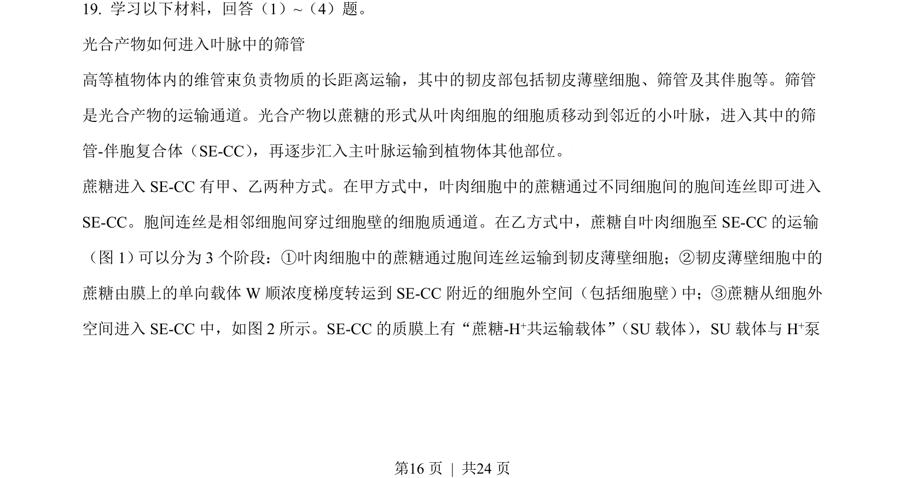
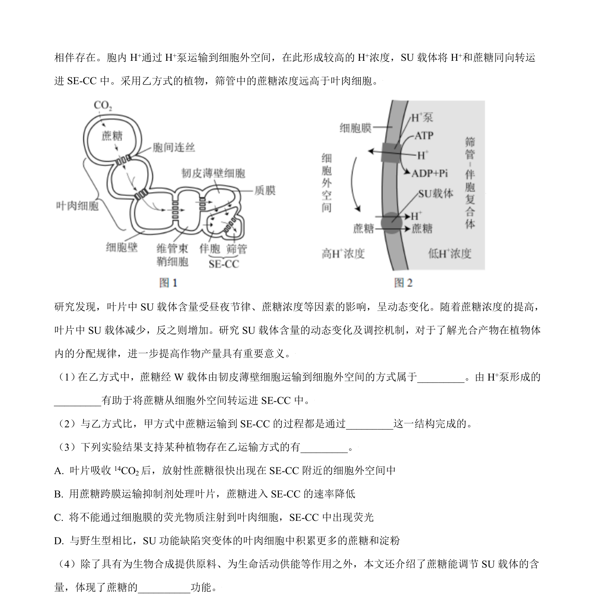
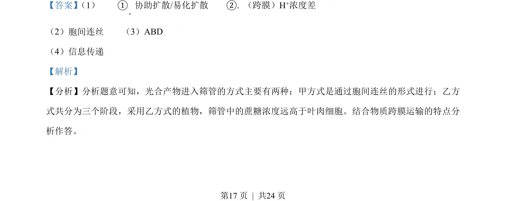
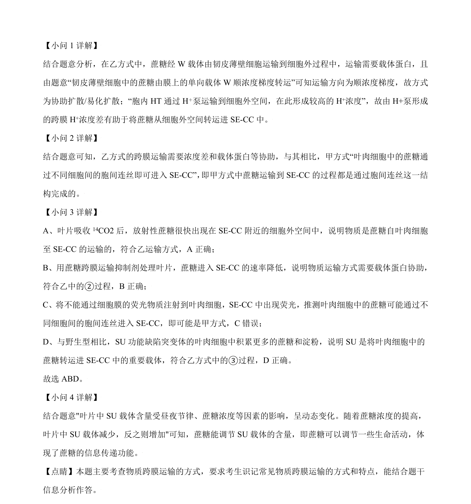

## 题面

## 摘要

考查物质跨膜运输方式（协助扩散、胞间连丝）及遗传规律与基因工程应用。

## 关联考点

- [[257-协助扩散|协助扩散]]
- [[688-胞间连丝|胞间连丝]]
- [[477-基因分离定律|基因分离定律]]
- [[410-PCR|PCR]]

## 答案与解析

> 📄 原 PDF 第 16 页：`素材/真题/北京/2008-2024·（北京）生物高考真题/2021年高考生物试卷（北京）（解析卷）.pdf`
