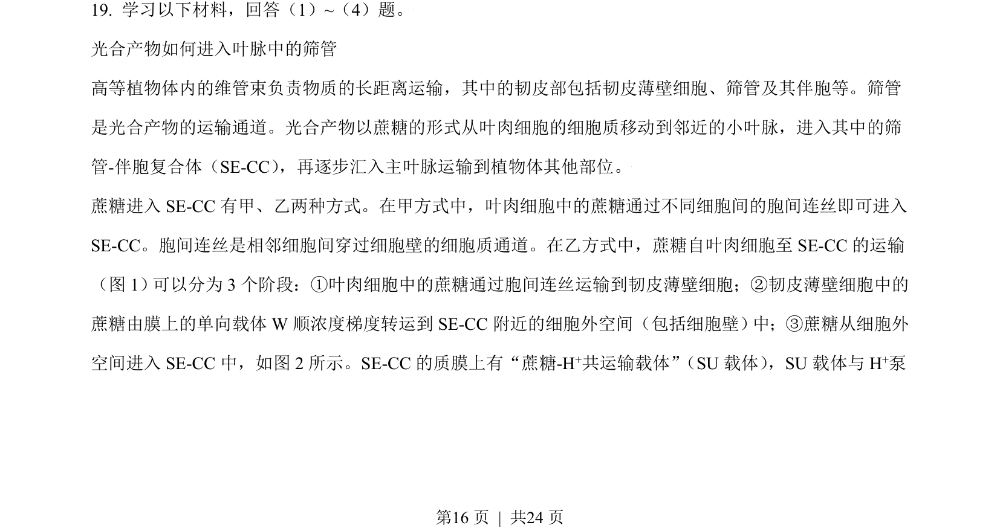
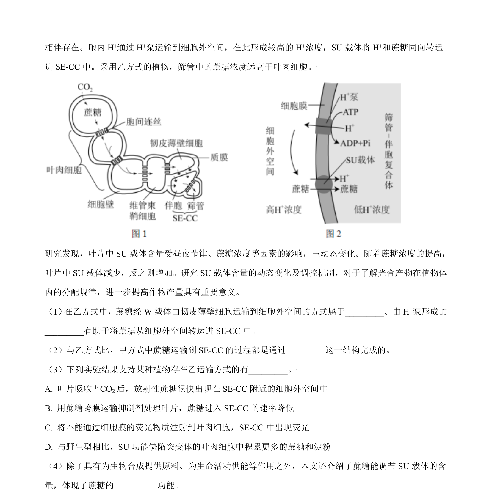
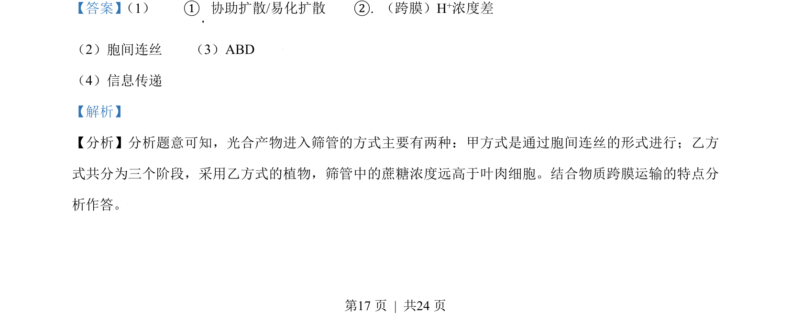
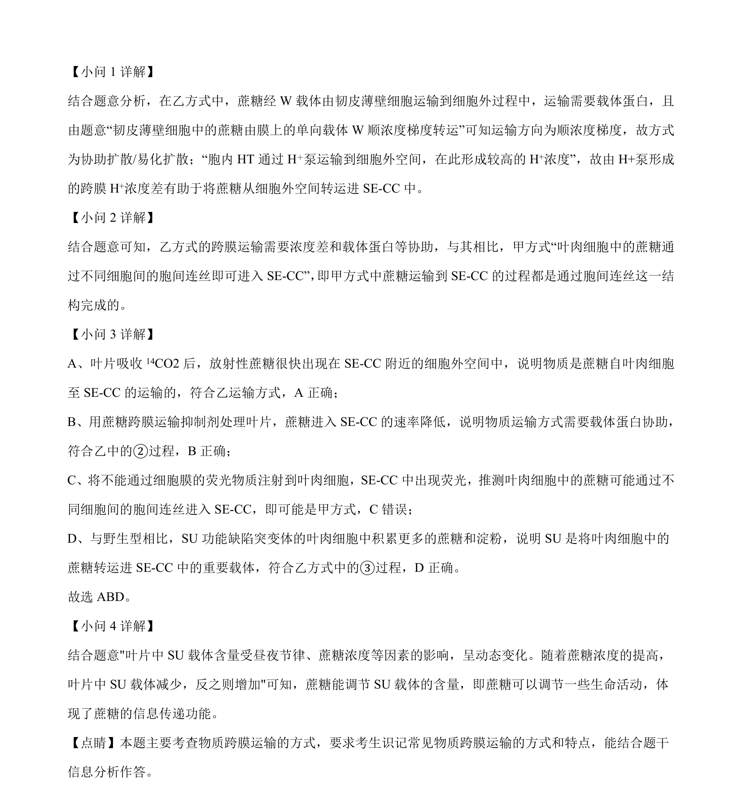

## 题面

## 摘要

考查物质跨膜运输方式（协助扩散、胞间连丝）及遗传规律与基因工程应用。

## 关联考点

- [[257-协助扩散|协助扩散]]
- [[688-胞间连丝|胞间连丝]]
- [[477-基因分离定律|基因分离定律]]
- [[410-PCR|PCR]]

## 答案与解析

> 📄 原 PDF 第 16 页：`素材/真题/北京/2008-2024·（北京）生物高考真题/2021年高考生物试卷（北京）（解析卷）.pdf`

<!-- 题干文本-start -->
## 题干文本
19. 学习以下材料，回答（1）~（4）题。
光合产物如何进入叶脉中的筛管
高等植物体内的维管束负责物质的长距离运输，其中的韧皮部包括韧皮薄壁细胞、筛管及其伴胞等。筛管
是光合产物的运输通道。光合产物以蔗糖的形式从叶肉细胞的细胞质移动到邻近的小叶脉，进入其中的筛
管-伴胞复合体（SE-CC） ，再逐步汇入主叶脉运输到植物体其他部位。
蔗糖进入 SE-CC 有甲、乙两种方式。在甲方式中，叶肉细胞中的蔗糖通过不同细胞间的胞间连丝即可进入
SE-CC。胞间连丝是相邻细胞间穿过细胞壁的细胞质通道。在乙方式中，蔗糖自叶肉细胞至 SE-CC 的运输
（图 1） 可以分为3 个阶段：①叶肉细胞中的蔗糖通过胞间连丝运输到韧皮薄壁细胞；②韧皮薄壁细胞中的
蔗糖由膜上的单向载体 W顺浓度梯度转运到 SE-CC 附近的细胞外空间（包括细胞壁） 中；③蔗糖从细胞外
空间进入 SE-CC 中，如图 2 所示。SE-CC 的质膜上有“蔗糖-H+共运输载体”（SU 载体） ，SU 载体与 H+泵
<!-- 题干文本-end -->

<!-- 解析文本-start -->
## 解析文本

<!-- 解析文本-end -->
