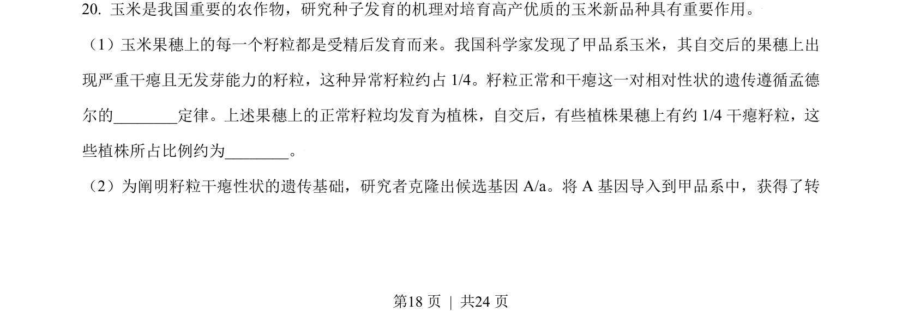
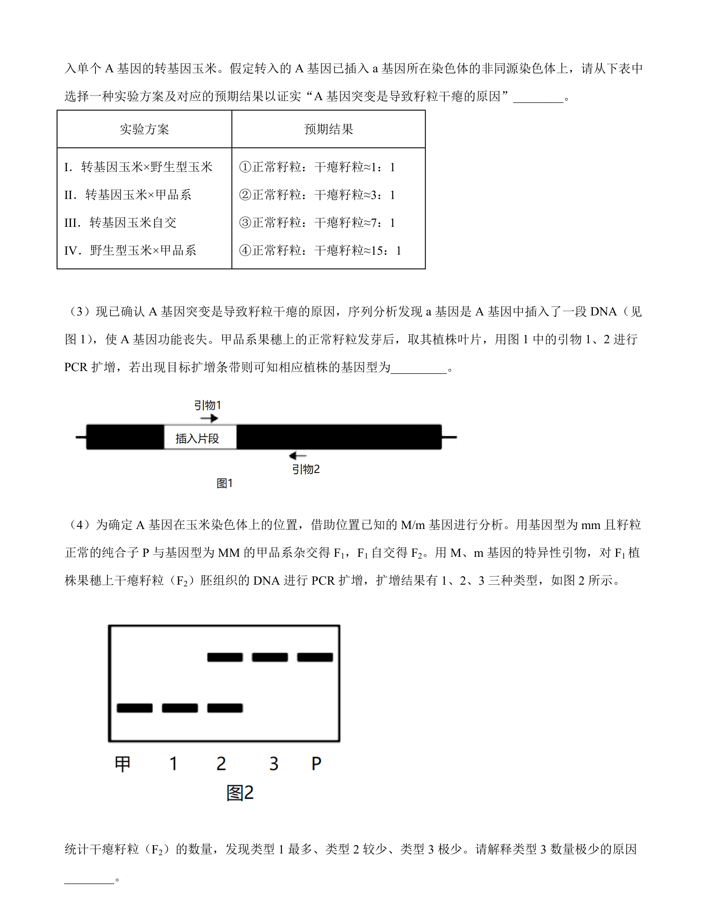
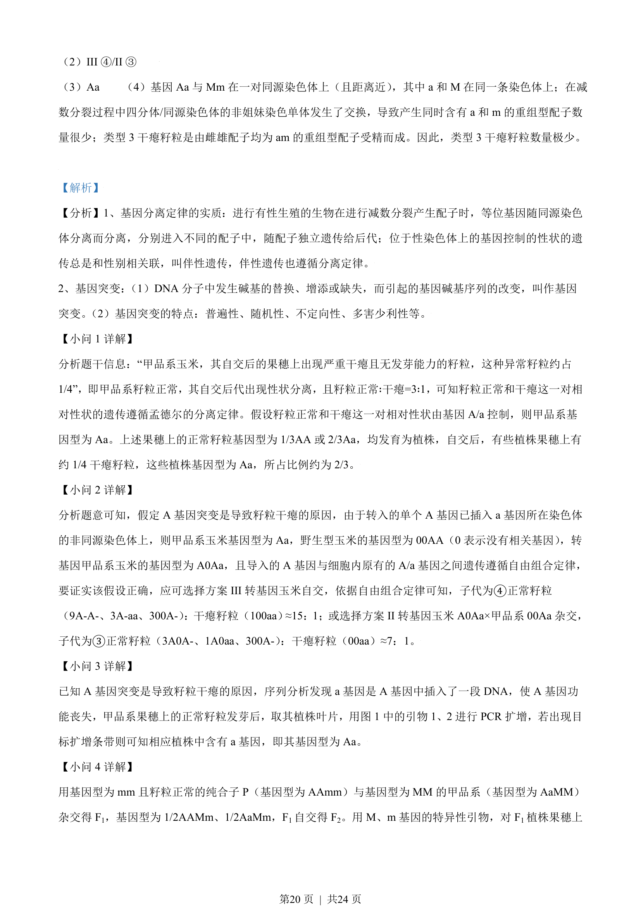
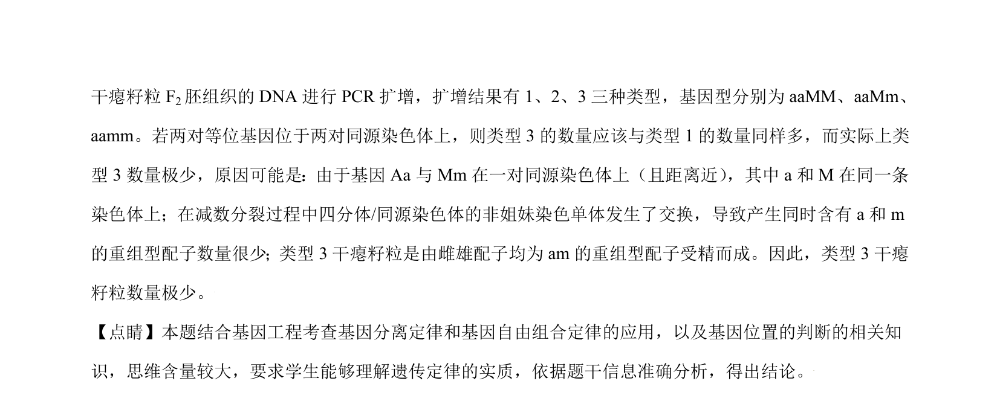

## 题面

## 摘要

该题考查基因分离定律、自由组合定律、基因突变及PCR技术应用，涉及遗传规律实质与基因位置判断。

## 关联考点

- [[477-基因分离定律|基因分离定律]]
- [[580-基因自由组合定律|基因自由组合定律]]
- [[301-基因突变|基因突变]]
- [[410-PCR|PCR]]

## 答案与解析

> 📄 原 PDF 第 18 页：`素材/真题/北京/2008-2024·（北京）生物高考真题/2021年高考生物试卷（北京）（解析卷）.pdf`

<!-- 题干文本-start -->
## 题干文本
20. 玉米是我国重要的农作物，研究种子发育的机理对培育高产优质的玉米新品种具有重要作用。
（1）玉米果穗上的每一个籽粒都是受精后发育而来。我国科学家发现了甲品系玉米，其自交后的果穗上出
现严重干瘪且无发芽能力的籽粒，这种异常籽粒约占 1/4。籽粒正常和干瘪这一对相对性状的遗传遵循孟德
尔的________定律。上述果穗上的正常籽粒均发育为植株，自交后，有些植株果穗上有约1/4干瘪籽粒，这
些植株所占比例约为________。
（2）为阐明籽粒干瘪性状的遗传基础，研究者克隆出候选基因 A/a。将 A 基因导入到甲品系中，获得了转
<!-- 题干文本-end -->

<!-- 解析文本-start -->
## 解析文本

<!-- 解析文本-end -->
