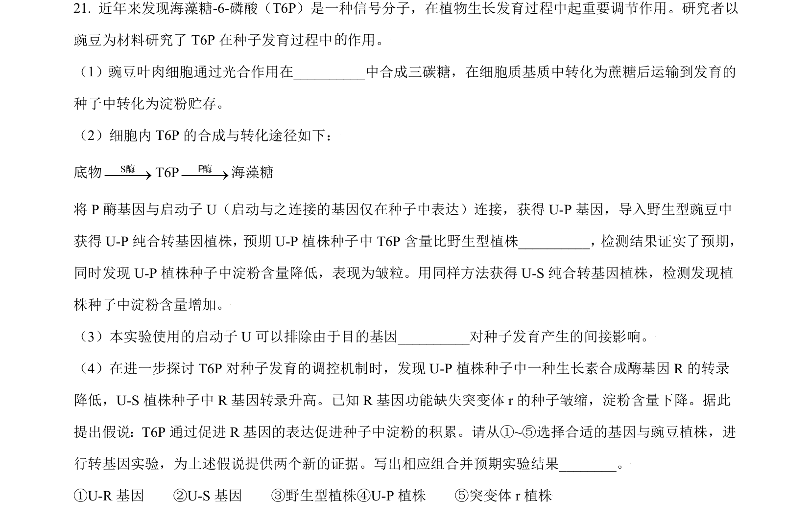
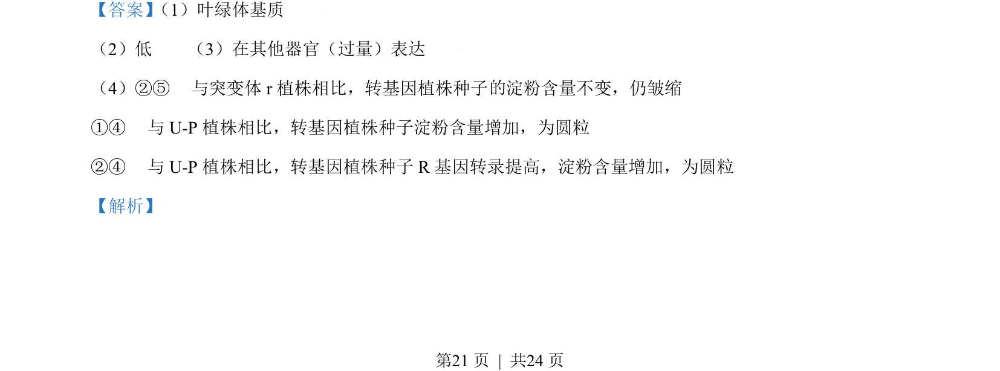
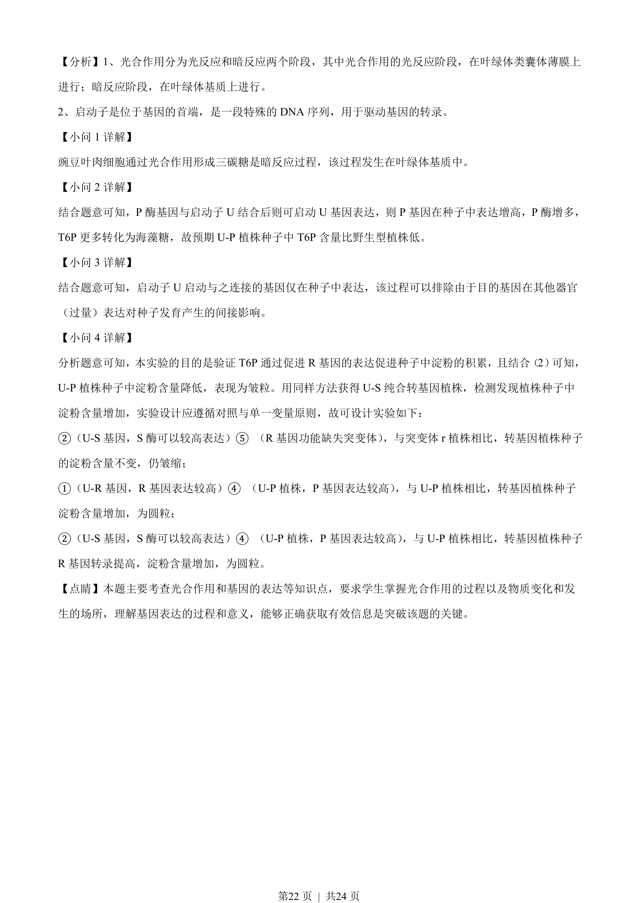

## 题面

## 摘要

豌豆叶肉细胞光合作用暗反应场所及启动子驱动的转基因实验设计与分析

## 关联考点

- [[033-光合作用|光合作用]]
- [[581-基因表达调控|基因表达调控]]
- [[750-启动子|启动子]]
- [[482-实验设计|实验设计]]

## 答案与解析

> 📄 原 PDF 第 21 页：`素材/真题/北京/2008-2024·（北京）生物高考真题/2021年高考生物试卷（北京）（解析卷）.pdf`
