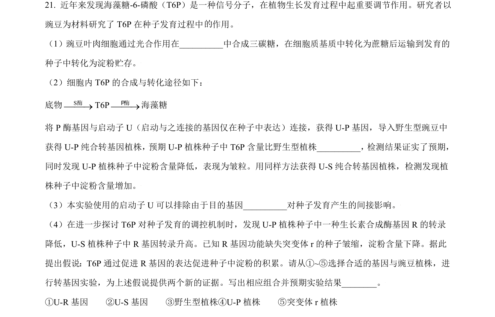
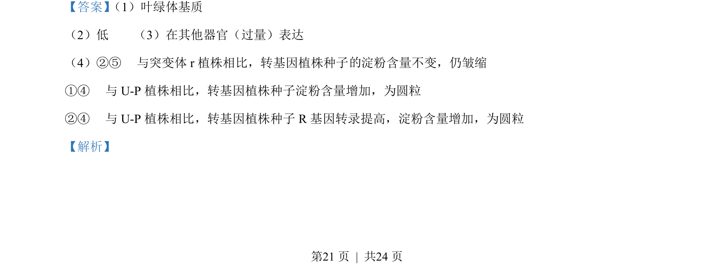
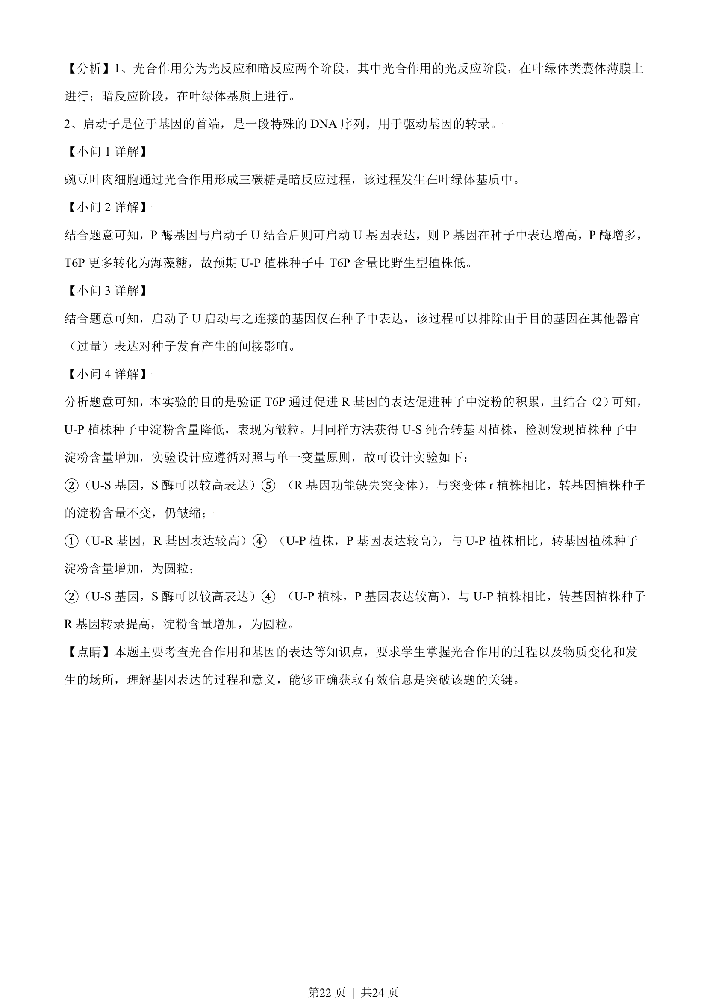

## 题面

## 摘要

豌豆叶肉细胞光合作用暗反应场所及启动子驱动的转基因实验设计与分析

## 关联考点

- [[033-光合作用|光合作用]]
- [[581-基因表达调控|基因表达调控]]
- [[750-启动子|启动子]]
- [[482-实验设计|实验设计]]

## 答案与解析

> 📄 原 PDF 第 21 页：`素材/真题/北京/2008-2024·（北京）生物高考真题/2021年高考生物试卷（北京）（解析卷）.pdf`

<!-- 题干文本-start -->
## 题干文本
21. 近年来发现海藻糖-6-磷酸（T6P）是一种信号分子，在植物生长发育过程中起重要调节作用。研究者以
豌豆为材料研究了 T6P在种子发育过程中 作用。
（1）豌豆叶肉细胞通过光合作用在__________中合成三碳糖，在细胞质基质中转化为蔗糖后运输到发育的
种子中转化为淀粉贮存。
（2）细胞内 T6P的合成与转化途径如下：
底物S¾¾ ®酶T6P¾¾ ®P酶海藻糖
将 P 酶基因与启动子 U（启动与之连接的基因仅在种子中表达）连接，获得 U-P 基因，导入野生型豌豆中
获得 U-P 纯合转基因植株， 预期U-P 植株种子中 T6P含量比野生型植株__________， 检测结果证实了预期，
同时发现 U-P 植株种子中淀粉含量降低，表现为皱粒。用同样方法获得 U-S 纯合转基因植株，检测发现植
株种子中淀粉含量增加。
（3）本实验使用的启动子 U 可以排除由于目的基因__________对种子发育产生的间接影响。
（4）在进一步探讨 T6P对种子发育的调控机制时，发现 U-P 植株种子中一种生长素合成酶基因 R的转录
降低，U-S 植株种子中 R基因转录升高。已知 R基因功能缺失突变体 r 的种子皱缩，淀粉含量下降。据此
提出假说：T6P通过促进 R基因的表达促进种子中淀粉的积累。请从①~⑤选择合适的基因与豌豆植株，进
行转基因实验，为上述假说提供两个新的证据。写出相应组合并预期实验结果________。
①U-R 基因    ②U-S 基因    ③野生型植株④U-P 植株    ⑤突变体 r 植株
<!-- 题干文本-end -->

<!-- 解析文本-start -->
## 解析文本
【答案】 （1）叶绿体基质    
（2）低    （3）在其他器官（过量）表达    
（4）②⑤   与突变体 r 植株相比，转基因植株种子 淀粉含量不变，仍皱缩
①④   与 U-P 植株相比，转基因植株种子淀粉含量增加，为圆粒
②④   与 U-P 植株相比，转基因植株种子 R基因转录提高，淀粉含量增加，为圆粒
【解析】
的
的
<!-- 解析文本-end -->
