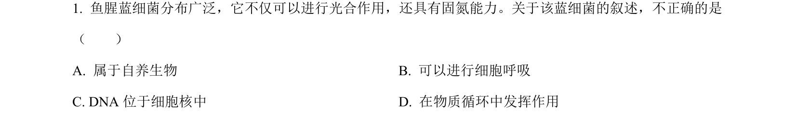
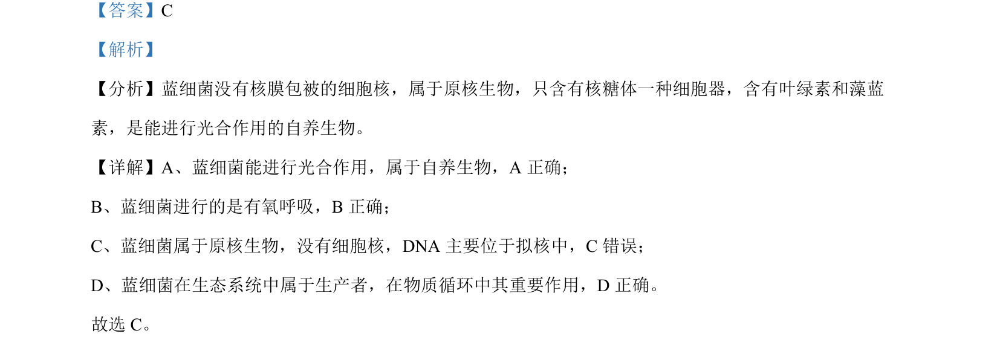

## 题面

## 摘要

本题主要考查蓝细菌的结构、代谢类型及其生态功能。

## 关联考点

- [[561-原核生物|原核生物]]
- [[蓝细菌]]
- [[033-光合作用|光合作用]]
- [[382-生产者|自养生物]]

## 答案与解析

> 📄 原 PDF 第 1 页：`素材/真题/北京/2008-2024·（北京）生物高考真题/2022年高考生物试卷（北京）（解析卷）.pdf`
