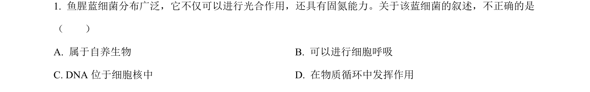
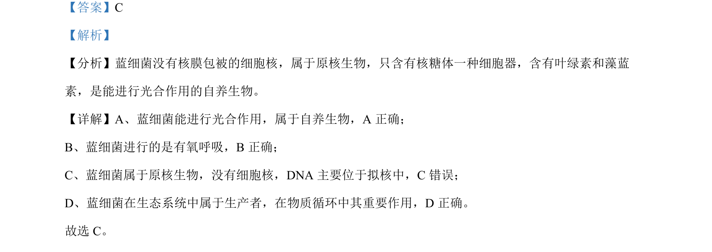

## 题面

## 摘要

本题主要考查蓝细菌的结构、代谢类型及其生态功能。

## 关联考点

- [[561-原核生物|原核生物]]
- [[蓝细菌]]
- [[033-光合作用|光合作用]]
- [[382-生产者|自养生物]]

## 答案与解析

> 📄 原 PDF 第 1 页：`素材/真题/北京/2008-2024·（北京）生物高考真题/2022年高考生物试卷（北京）（解析卷）.pdf`

<!-- 题干文本-start -->
## 题干文本
1. 鱼腥蓝细菌分布广泛，它不仅可以进行光合作用，还具有固氮能力。关于该蓝细菌的叙述，不正确的是
（　　）
A. 属于自养生物 B. 可以进行细胞呼吸
C. DNA 位于细胞核中 D. 在物质循环中发挥作用
<!-- 题干文本-end -->

<!-- 解析文本-start -->
## 解析文本
【答案】C
【解析】
【分析】蓝细菌没有核膜包被的细胞核，属于原核生物，只含有核糖体一种细胞器，含有叶绿素和藻蓝
素，是能进行光合作用的自养生物。
【详解】A、蓝细菌能进行光合作用，属于自养生物，A 正确；
B、蓝细菌进行的是有氧呼吸，B正确；
C、蓝细菌属于原核生物，没有细胞核，DNA 主要位于拟核中，C错误；
D、蓝细菌在生态系统中属于生产者，在物质循环中其重要作用，D 正确。
故选 C。
<!-- 解析文本-end -->
