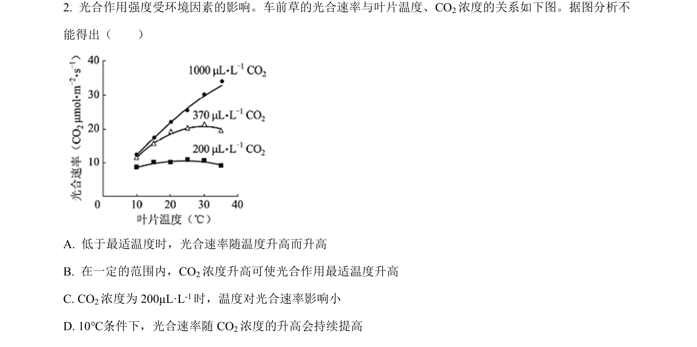
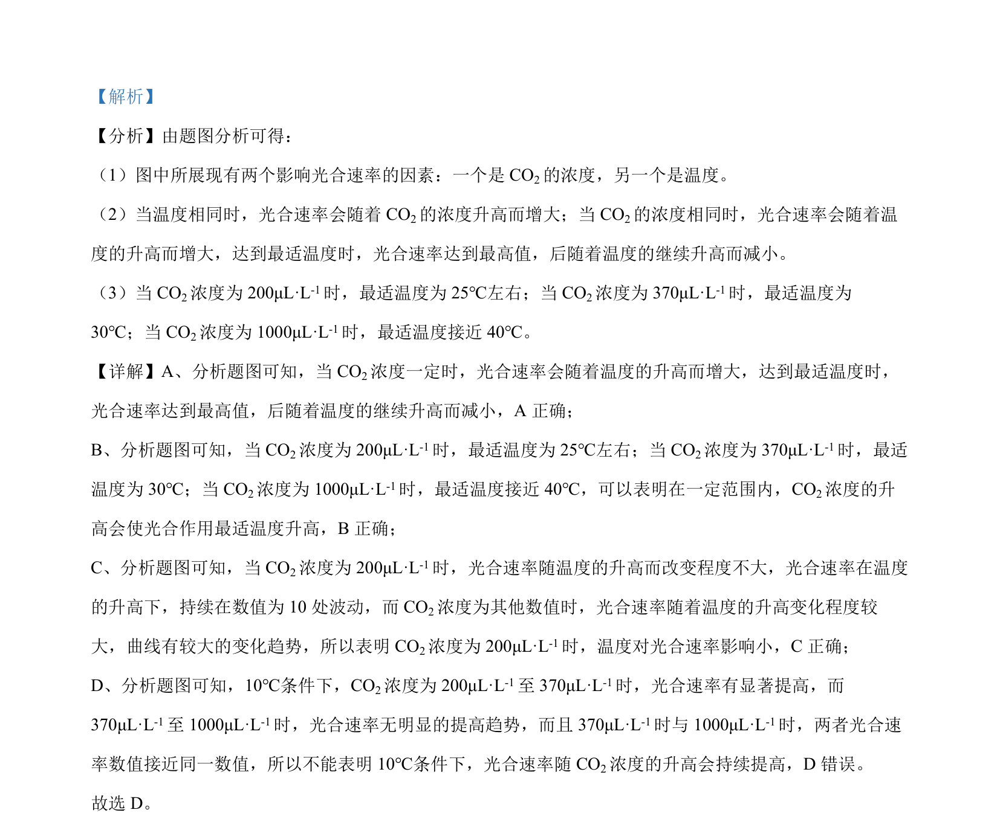

## 题面

## 摘要

光合速率受CO2浓度和温度影响的曲线分析

## 关联考点

- [[819-影响光合作用的因素|影响光合作用的因素]]
- [[543-光合作用强度|光合速率]]
- [[523-CO2浓度|CO2浓度]]
- [[035-温度|温度]]

## 答案与解析

> 📄 原 PDF 第 1 页：`素材/真题/北京/2008-2024·（北京）生物高考真题/2022年高考生物试卷（北京）（解析卷）.pdf`
