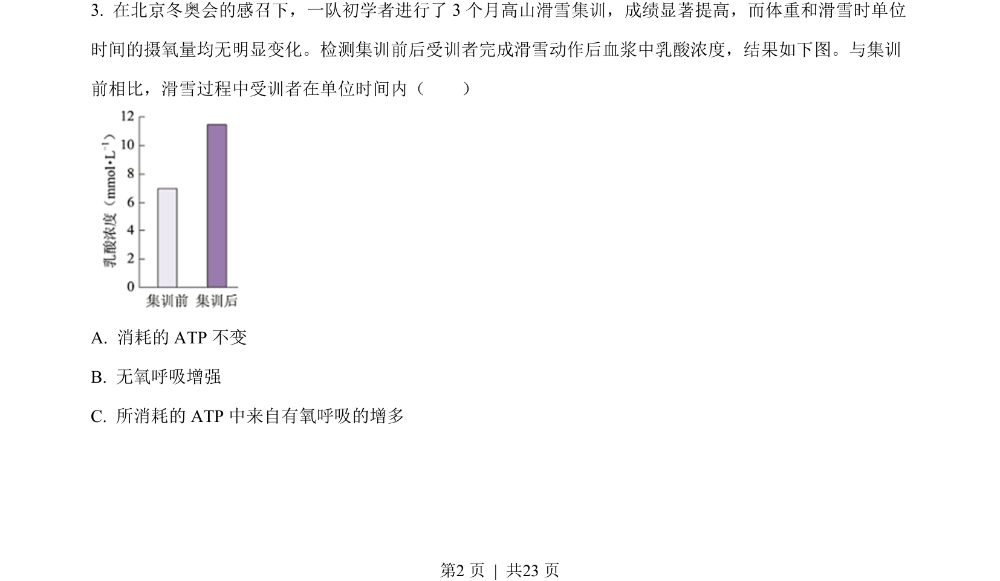
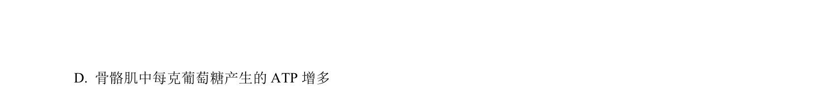
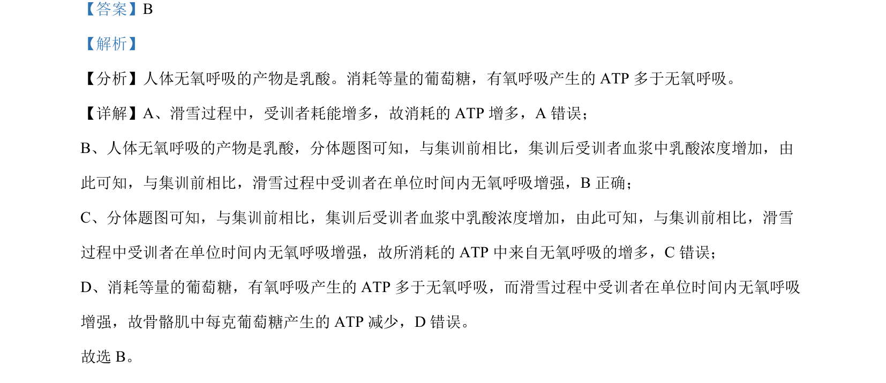

## 题面

## 摘要

滑雪训练后血浆乳酸浓度升高说明无氧呼吸增强，消耗等量葡萄糖有氧呼吸产生ATP更多。

## 关联考点

- [[238-无氧呼吸|无氧呼吸]]
- [[240-有氧呼吸|有氧呼吸]]
- [[234-ATP|ATP]]
- [[乳酸]]

## 答案与解析

> 📄 原 PDF 第 2 页：`素材/真题/北京/2008-2024·（北京）生物高考真题/2022年高考生物试卷（北京）（解析卷）.pdf`
