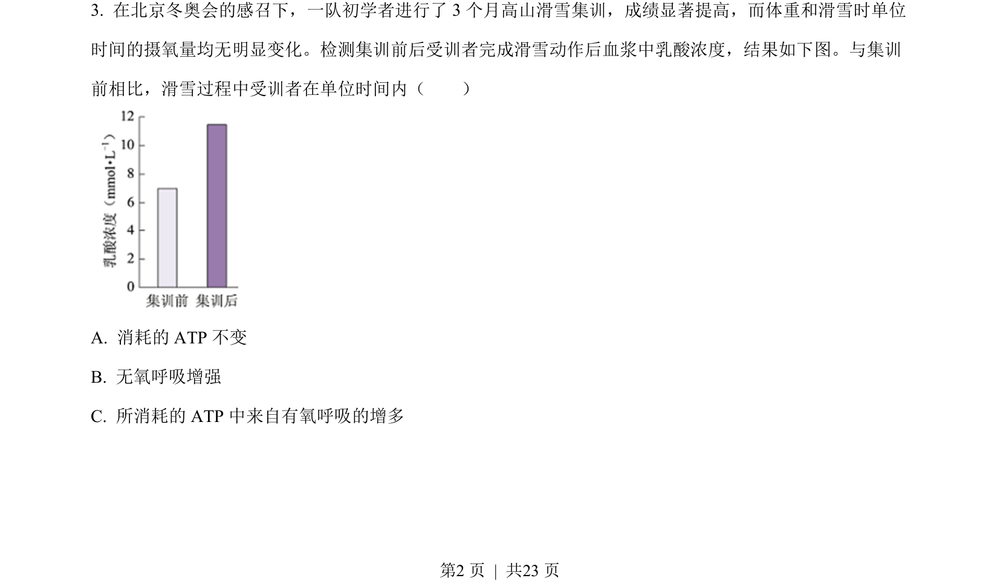
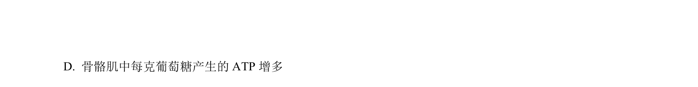
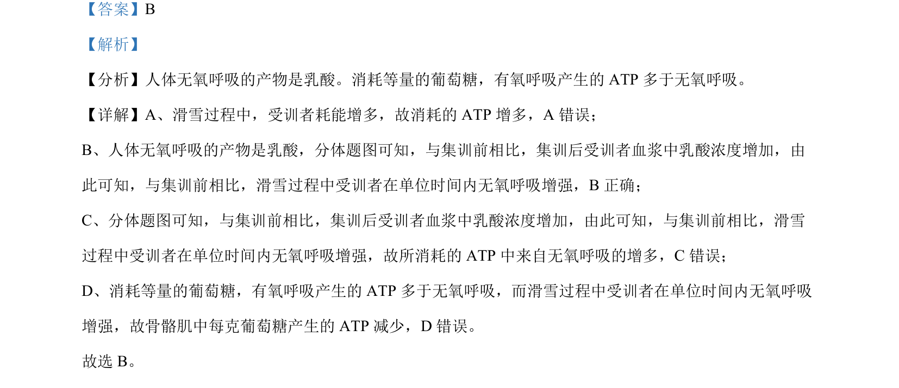

## 题面

## 摘要

滑雪训练后血浆乳酸浓度升高说明无氧呼吸增强，消耗等量葡萄糖有氧呼吸产生ATP更多。

## 关联考点

- [[238-无氧呼吸|无氧呼吸]]
- [[240-有氧呼吸|有氧呼吸]]
- [[234-ATP|ATP]]
- [[乳酸]]

## 答案与解析

> 📄 原 PDF 第 2 页：`素材/真题/北京/2008-2024·（北京）生物高考真题/2022年高考生物试卷（北京）（解析卷）.pdf`

<!-- 题干文本-start -->
## 题干文本
3. 在北京冬奥会的感召下，一队初学者进行了 3 个月高山滑雪集训，成绩显著提高，而体重和滑雪时单位
时间的摄氧量均无明显变化。检测集训前后受训者完成滑雪动作后血浆中乳酸浓度，结果如下图。与集训
前相比，滑雪过程中受训者在单位时间内（　　）
A. 消耗的 ATP 不变
B. 无氧呼吸增强
C. 所消耗的 ATP 中来自有氧呼吸的增多
<!-- 题干文本-end -->

<!-- 解析文本-start -->
## 解析文本

<!-- 解析文本-end -->
