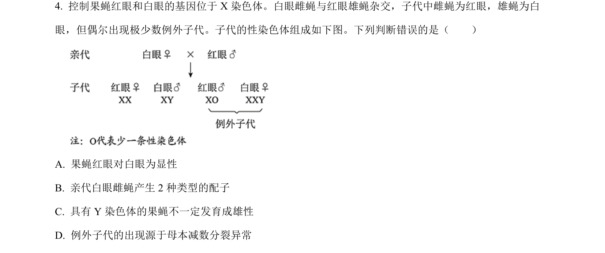
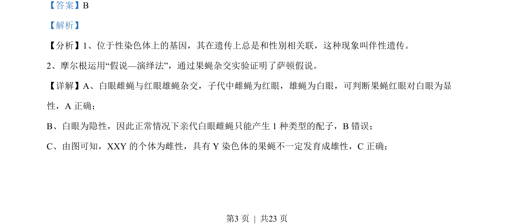
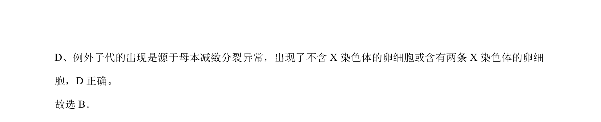

## 题面

## 摘要

摩尔根果蝇杂交实验证明伴性遗传，分析白眼突变体例外子代成因；蜜蜂性别由染色体倍数决定，不同于果蝇XY型。

## 关联考点

- [[276-伴性遗传|伴性遗传]]
- [[301-基因突变|基因突变]]
- [[305-染色体数目变异|染色体数目变异]]
- [[196-性别决定|性别决定]]

## 答案与解析

> 📄 原 PDF 第 3 页：`素材/真题/北京/2008-2024·（北京）生物高考真题/2022年高考生物试卷（北京）（解析卷）.pdf`
