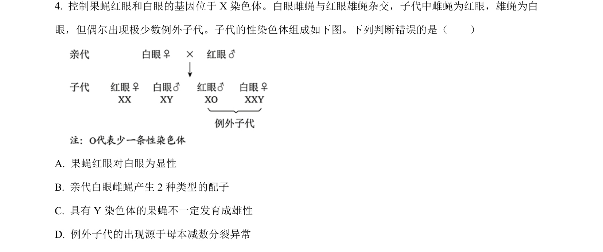
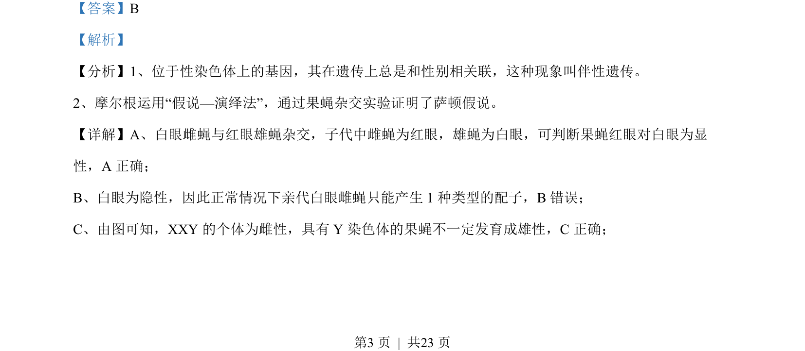
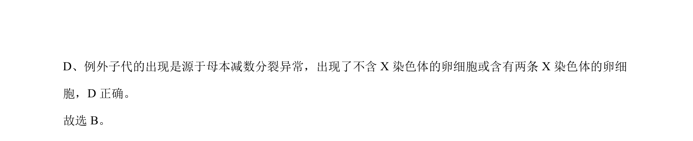

## 题面

## 摘要

摩尔根果蝇杂交实验证明伴性遗传，分析白眼突变体例外子代成因；蜜蜂性别由染色体倍数决定，不同于果蝇XY型。

## 关联考点

- [[276-伴性遗传|伴性遗传]]
- [[301-基因突变|基因突变]]
- [[305-染色体数目变异|染色体数目变异]]
- [[196-性别决定|性别决定]]

## 答案与解析

> 📄 原 PDF 第 3 页：`素材/真题/北京/2008-2024·（北京）生物高考真题/2022年高考生物试卷（北京）（解析卷）.pdf`

<!-- 题干文本-start -->
## 题干文本
4. 控制果蝇红眼和白眼的基因位于 X 染色体。白眼雌蝇与红眼雄蝇杂交，子代中雌蝇为红眼，雄蝇为白
眼，但偶尔出现极少数例外子代。子代的性染色体组成如下图。下列判断错误的是（　　）
A. 果蝇红眼对白眼为显性
B. 亲代白眼雌蝇产生 2 种类型的配子
C. 具有 Y 染色体的果蝇不一定发育成雄性
D. 例外子代的出现源于母本减数分裂异常
<!-- 题干文本-end -->

<!-- 解析文本-start -->
## 解析文本
【答案】B
【解析】
【分析】1、位于性染色体上的基因，其在遗传上总是和性别相关联，这种现象叫伴性遗传。
2、摩尔根运用“假说—演绎法”，通过果蝇杂交实验证明了萨顿假说。
【详解】A、白眼雌蝇与红眼雄蝇杂交，子代中雌蝇为红眼，雄蝇为白眼，可判断果蝇红眼对白眼为显
性，A 正确；
B、白眼为隐性，因此正常情况下亲代白眼雌蝇只能产生 1 种类型的配子，B错误；
C、由图可知，XXY 的个体为雌性，具有 Y 染色体的果蝇不一定发育成雄性，C正确；
<!-- 解析文本-end -->
