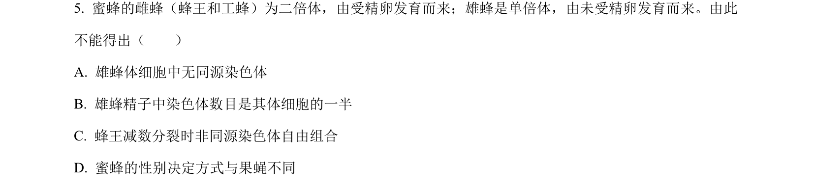
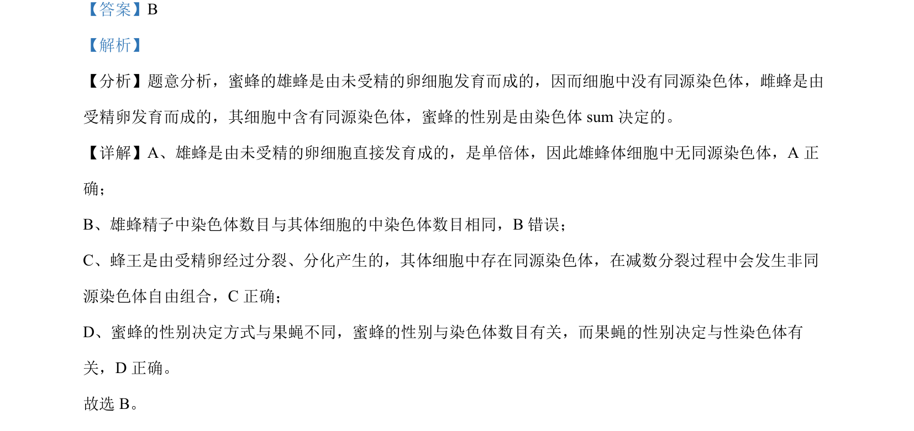

## 题面

## 摘要

蜜蜂雄蜂单倍体无同源染色体，雌蜂有同源染色体及减数分裂非同源染色体自由组合

## 关联考点

- [[300-单倍体|单倍体]]
- [[245-同源染色体|同源染色体]]
- [[616-染色体数目|染色体数目]]
- [[196-性别决定|性别决定]]

## 答案与解析

> 📄 原 PDF 第 4 页：`素材/真题/北京/2008-2024·（北京）生物高考真题/2022年高考生物试卷（北京）（解析卷）.pdf`

<!-- 题干文本-start -->
## 题干文本
5. 蜜蜂的雌蜂（蜂王和工蜂）为二倍体，由受精卵发育而来；雄蜂是单倍体，由未受精卵发育而来。由此
不能得出（　　）
A. 雄蜂体细胞中无同源染色体
B. 雄蜂精子中染色体数目是其体细胞的一半
C. 蜂王减数分裂时非同源染色体自由组合
D. 蜜蜂的性别决定方式与果蝇不同
<!-- 题干文本-end -->

<!-- 解析文本-start -->
## 解析文本
【答案】B
【解析】
【分析】题意分析，蜜蜂的雄蜂是由未受精的卵细胞发育而成的，因而细胞中没有同源染色体，雌蜂是由
受精卵发育而成的，其细胞中含有同源染色体，蜜蜂的性别是由染色体 sum决定的。
【详解】A、雄蜂是由未受精的卵细胞直接发育成的，是单倍体，因此雄蜂体细胞中无同源染色体，A 正
确；
B、雄蜂精子中染色体数目与其体细胞的中染色体数目相同，B错误；
C、蜂王是由受精卵经过分裂、分化产生的，其体细胞中存在同源染色体，在减数分裂过程中会发生非同
源染色体自由组合，C正确；
D、蜜蜂的性别决定方式与果蝇不同，蜜蜂的性别与染色体数目有关，而果蝇的性别决定与性染色体有
关，D 正确。
故选 B。
<!-- 解析文本-end -->
