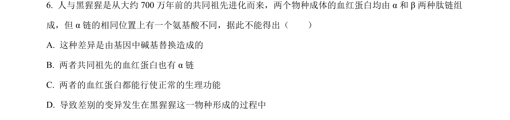
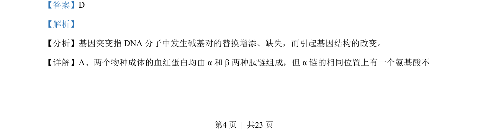
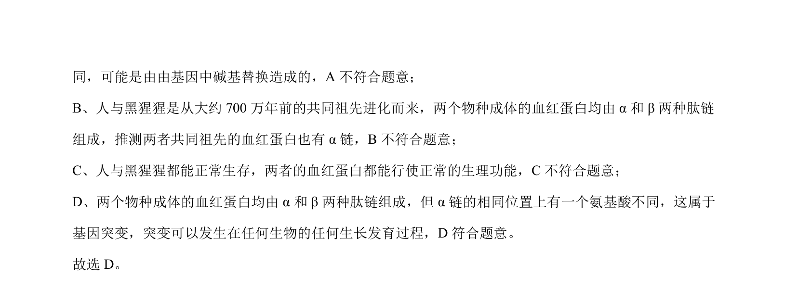

## 题面

## 摘要

通过血红蛋白差异分析考查基因突变与生物进化关系

## 关联考点

- [[301-基因突变|基因突变]]
- [[923-蛋白质结构|蛋白质结构]]
- [[分子进化]]

## 答案与解析

> 📄 原 PDF 第 4 页：`素材/真题/北京/2008-2024·（北京）生物高考真题/2022年高考生物试卷（北京）（解析卷）.pdf`

<!-- 题干文本-start -->
## 题干文本
6. 人与黑猩猩是从大约 700 万年前的共同祖先进化而来，两个物种成体的血红蛋白均由 α和 β两种肽链组
成，但 α链的相同位置上有一个氨基酸不同，据此不能得出（　　）
A. 这种差异是由基因中碱基替换造成的
B. 两者共同祖先的血红蛋白也有 α链
C. 两者的血红蛋白都能行使正常的生理功能
D. 导致差别的变异发生在黑猩猩这一物种形成的过程中
<!-- 题干文本-end -->

<!-- 解析文本-start -->
## 解析文本
【答案】D
【解析】
【分析】基因突变指 DNA 分子中发生碱基对的替换增添、缺失，而引起基因结构的改变。
【详解】A、两个物种成体的血红蛋白均由 α和 β两种肽链组成，但 α链的相同位置上有一个氨基酸不
<!-- 解析文本-end -->
