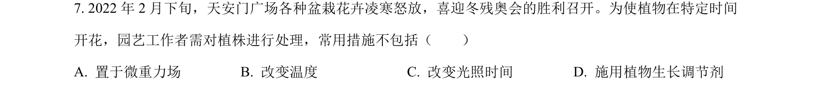
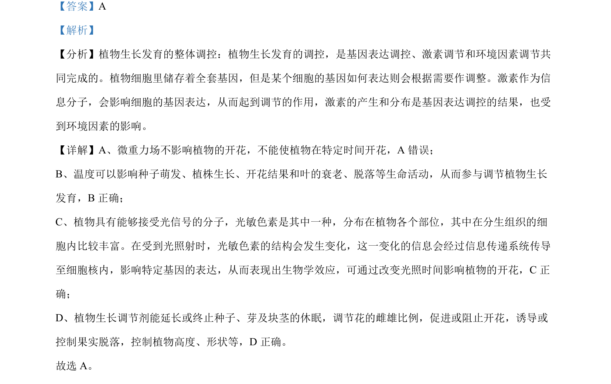

## 题面

## 摘要

植物生长发育受基因表达、激素和环境因素共同调控，题目判断各选项正误

## 关联考点

- [[植物生长发育]]
- [[581-基因表达调控|基因表达调控]]
- [[331-激素调节|激素调节]]
- [[环境因素调节]]

## 答案与解析

> 📄 原 PDF 第 5 页：`素材/真题/北京/2008-2024·（北京）生物高考真题/2022年高考生物试卷（北京）（解析卷）.pdf`
