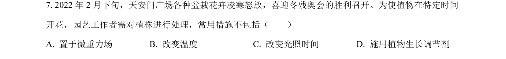
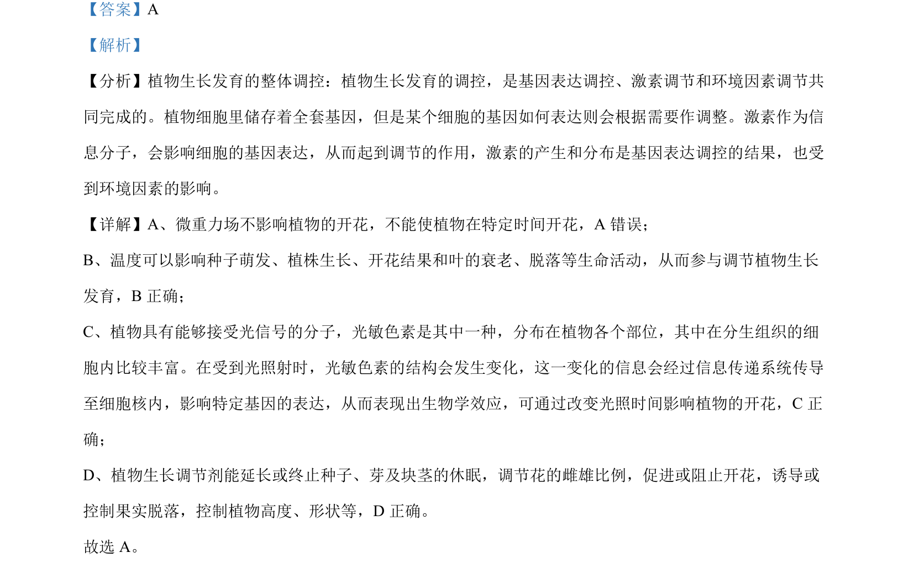

## 题面

## 摘要

植物生长发育受基因表达、激素和环境因素共同调控，题目判断各选项正误

## 关联考点

- [[植物生长发育]]
- [[581-基因表达调控|基因表达调控]]
- [[331-激素调节|激素调节]]
- [[环境因素调节]]

## 答案与解析

> 📄 原 PDF 第 5 页：`素材/真题/北京/2008-2024·（北京）生物高考真题/2022年高考生物试卷（北京）（解析卷）.pdf`

<!-- 题干文本-start -->
## 题干文本
7. 2022 年 2 月下旬，天安门广场各种盆栽花卉凌寒怒放，喜迎冬残奥会的胜利召开。为使植物在特定时间
开花，园艺工作者需对植株进行处理，常用措施不包括（　　）
A. 置于微重力场 B. 改变温度 C. 改变光照时间 D. 施用植物生长调节剂
<!-- 题干文本-end -->

<!-- 解析文本-start -->
## 解析文本
【答案】A
【解析】
【分析】植物生长发育的整体调控：植物生长发育的调控，是基因表达调控、激素调节和环境因素调节共
同完成的。植物细胞里储存着全套基因，但是某个细胞的基因如何表达则会根据需要作调整。激素作为信
息分子，会影响细胞的基因表达，从而起到调节的作用，激素的产生和分布是基因表达调控的结果，也受
到环境因素的影响。
【详解】A、微重力场不影响植物的开花，不能使植物在特定时间开花，A 错误；
B、温度可以影响种子萌发、植株生长、开花结果和叶的衰老、脱落等生命活动，从而参与调节植物生长
发育，B正确；
C、植物具有能够接受光信号的分子，光敏色素是其中一种，分布在植物各个部位，其中在分生组织的细
胞内比较丰富。在受到光照射时，光敏色素的结构会发生变化，这一变化的信息会经过信息传递系统传导
至细胞核内，影响特定基因的表达，从而表现出生物学效应，可通过改变光照时间影响植物的开花，C正
确；
D、植物生长调节剂能延长或终止种子、芽及块茎的休眠，调节花的雌雄比例，促进或阻止开花，诱导或
控制果实脱落，控制植物高度、形状等，D 正确。
故选 A。
<!-- 解析文本-end -->
