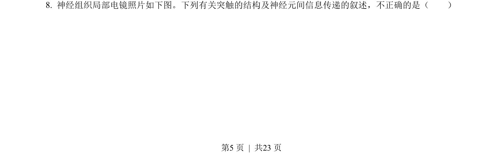
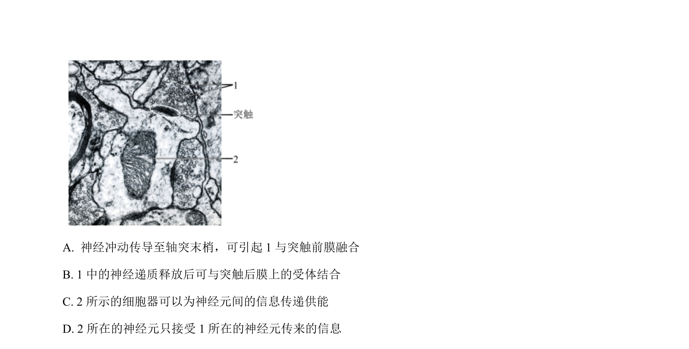
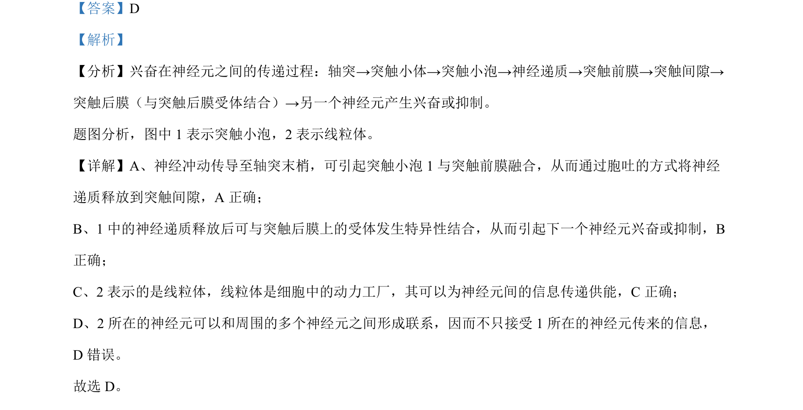

## 题面

## 摘要

本题考查兴奋在神经元间的传递，包括突触小泡融合、神经递质释放、受体结合及线粒体供能。

## 关联考点

- [[突触传递]]
- [[神经递质释放]]
- [[259-胞吐|胞吐]]
- [[883-线粒体功能|线粒体功能]]

## 答案与解析

> 📄 原 PDF 第 5 页：`素材/真题/北京/2008-2024·（北京）生物高考真题/2022年高考生物试卷（北京）（解析卷）.pdf`
