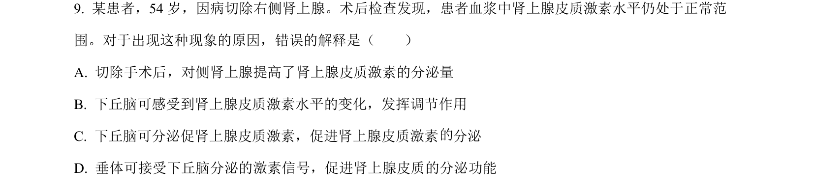
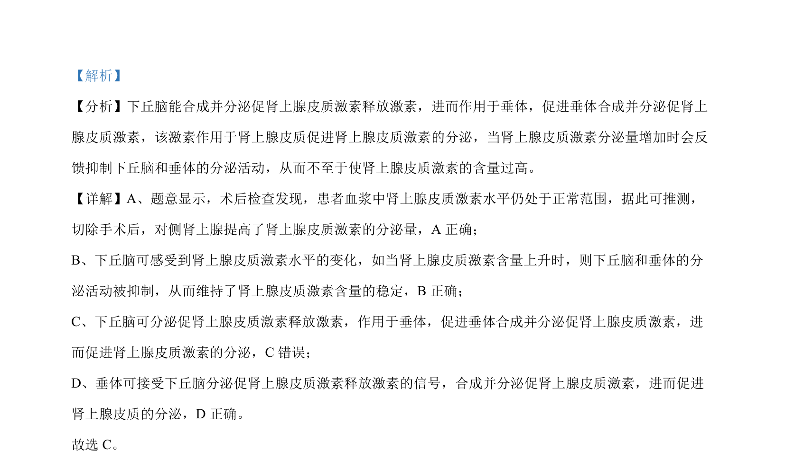

## 题面

## 摘要

本题通过术后肾上腺皮质激素水平仍正常的情境，考查肾上腺皮质激素分泌的分级调节与反馈调节机制。

## 关联考点

- [[肾上腺皮质激素分泌调节]]
- [[472-分级调节|分级调节]]
- [[334-反馈调节|反馈调节]]
- [[下丘脑-垂体-肾上腺轴]]

## 答案与解析

> 📄 原 PDF 第 6 页：`素材/真题/北京/2008-2024·（北京）生物高考真题/2022年高考生物试卷（北京）（解析卷）.pdf`
