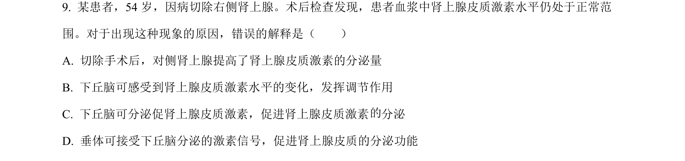
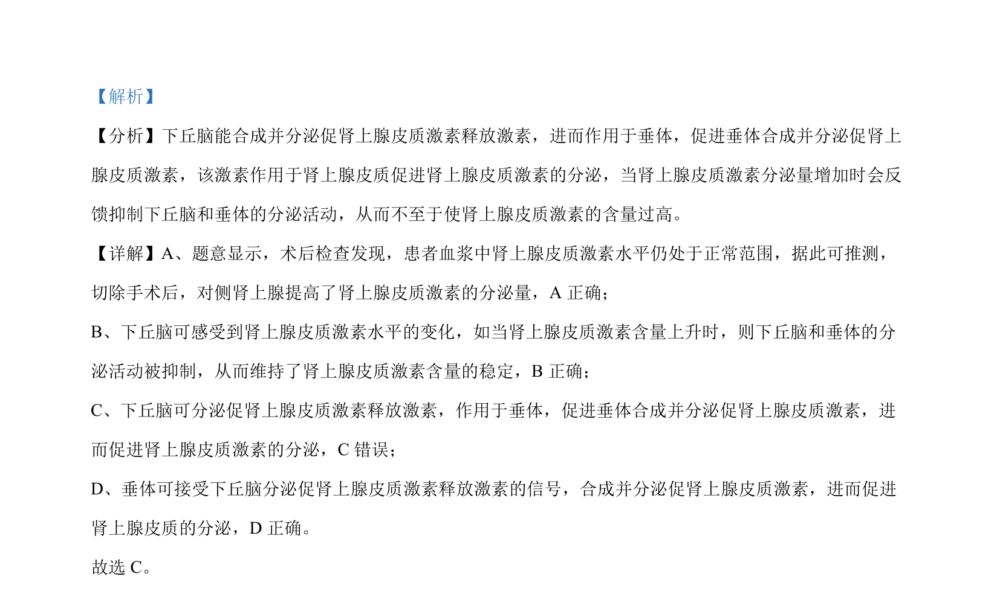

## 题面

## 摘要

本题通过术后肾上腺皮质激素水平仍正常的情境，考查肾上腺皮质激素分泌的分级调节与反馈调节机制。

## 关联考点

- [[肾上腺皮质激素分泌调节]]
- [[472-分级调节|分级调节]]
- [[334-反馈调节|反馈调节]]
- [[下丘脑-垂体-肾上腺轴]]

## 答案与解析

> 📄 原 PDF 第 6 页：`素材/真题/北京/2008-2024·（北京）生物高考真题/2022年高考生物试卷（北京）（解析卷）.pdf`

<!-- 题干文本-start -->
## 题干文本
9. 某患者，54 岁，因病切除右侧肾上腺。术后检查发现，患者血浆中肾上腺皮质激素水平仍处于正常范
围。对于出现这种现象的原因，错误的解释是（　　）
A. 切除手术后，对侧肾上腺提高了肾上腺皮质激素的分泌量
B. 下丘脑可感受到肾上腺皮质激素水平的变化，发挥调节作用
C. 下丘脑可分泌促肾上腺皮质激素，促进肾上腺皮质激素 分泌
D. 垂体可接受下丘脑分泌的激素信号，促进肾上腺皮质的分泌功能
<!-- 题干文本-end -->

<!-- 解析文本-start -->
## 解析文本
【答案】C
的
<!-- 解析文本-end -->
