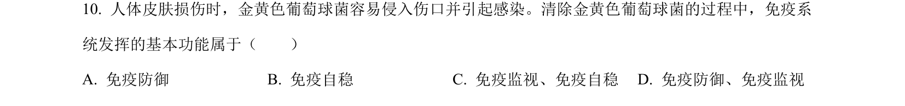
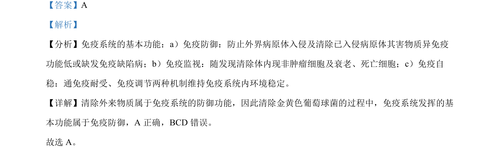

## 题面

## 摘要

该题考查免疫系统的基本功能，以金黄色葡萄球菌为例分析免疫防御机制。

## 关联考点

- [[免疫防御]]
- [[免疫监视]]
- [[免疫自稳]]

## 答案与解析

> 📄 原 PDF 第 7 页：`素材/真题/北京/2008-2024·（北京）生物高考真题/2022年高考生物试卷（北京）（解析卷）.pdf`

<!-- 题干文本-start -->
## 题干文本
10. 人体皮肤损伤时，金黄色葡萄球菌容易侵入伤口并引起感染。清除金黄色葡萄球菌的过程中，免疫系
统发挥的基本功能属于（　　）
A. 免疫防御 B. 免疫自稳 C. 免疫监视、免疫自稳 D. 免疫防御、免疫监视
<!-- 题干文本-end -->

<!-- 解析文本-start -->
## 解析文本
【答案】A
【解析】
【分析】免疫系统的基本功能：a）免疫防御：防止外界病原体入侵及清除已入侵病原体其害物质异免疫
功能低或缺发免疫缺陷病；b）免疫监视：随发现清除体内现非肿瘤细胞及衰老、死亡细胞；c）免疫自
稳：通免疫耐受、免疫调节两种机制维持免疫系统内环境稳定。
【详解】清除外来物质属于免疫系统的防御功能，因此清除金黄色葡萄球菌的过程中，免疫系统发挥的基
本功能属于免疫防御，A 正确，BCD 错误。
故选 A。
<!-- 解析文本-end -->
