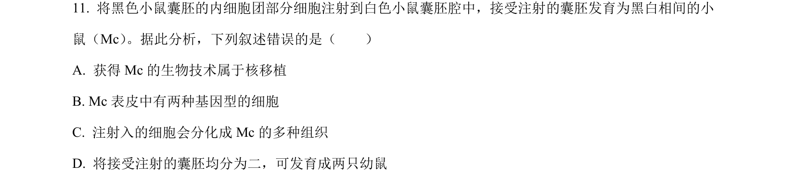
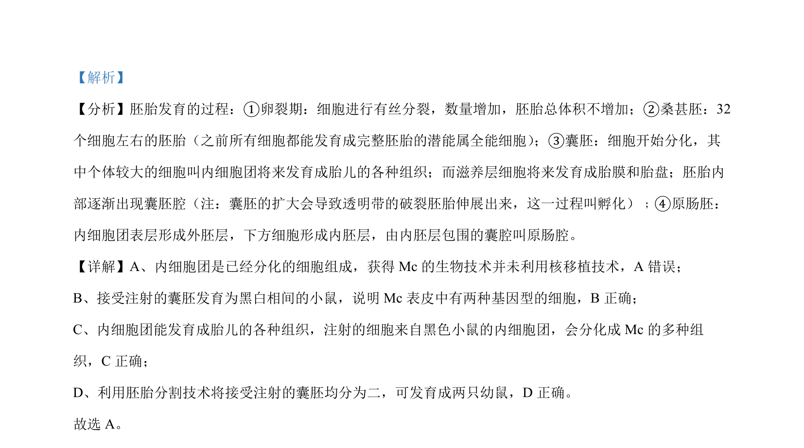

## 题面

## 摘要

高中生物学实验中操作顺序对结果的影响判断

## 关联考点

- [[检测生物组织中的蛋白质]]
- [[观察细胞质流动]]
- [[探究温度对酶活性的影响]]
- [[观察根尖分生区细胞有丝分裂]]

## 答案与解析

> 📄 原 PDF 第 7 页：`素材/真题/北京/2008-2024·（北京）生物高考真题/2022年高考生物试卷（北京）（解析卷）.pdf`
