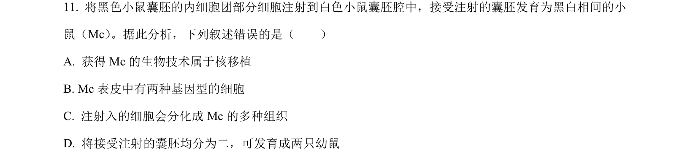
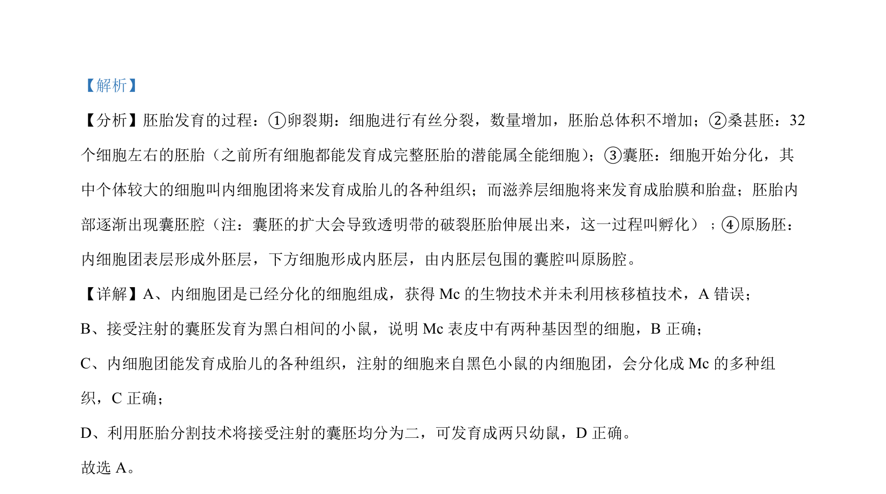

## 题面

## 摘要

高中生物学实验中操作顺序对结果的影响判断

## 关联考点

- [[检测生物组织中的蛋白质]]
- [[观察细胞质流动]]
- [[探究温度对酶活性的影响]]
- [[观察根尖分生区细胞有丝分裂]]

## 答案与解析

> 📄 原 PDF 第 7 页：`素材/真题/北京/2008-2024·（北京）生物高考真题/2022年高考生物试卷（北京）（解析卷）.pdf`

<!-- 题干文本-start -->
## 题干文本
11. 将黑色小鼠囊胚的内细胞团部分细胞注射到白色小鼠囊胚腔中，接受注射的囊胚发育为黑白相间的小
鼠（Mc） 。据此分析，下列叙述错误的是（　　）
A. 获得 Mc 的生物技术属于核移植
B. Mc 表皮中有两种基因型的细胞
C. 注射入的细胞会分化成 Mc 的多种组织
D. 将接受注射的囊胚均分为二，可发育成两只幼鼠
<!-- 题干文本-end -->

<!-- 解析文本-start -->
## 解析文本
【答案】A
<!-- 解析文本-end -->
